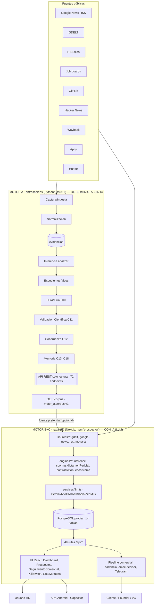
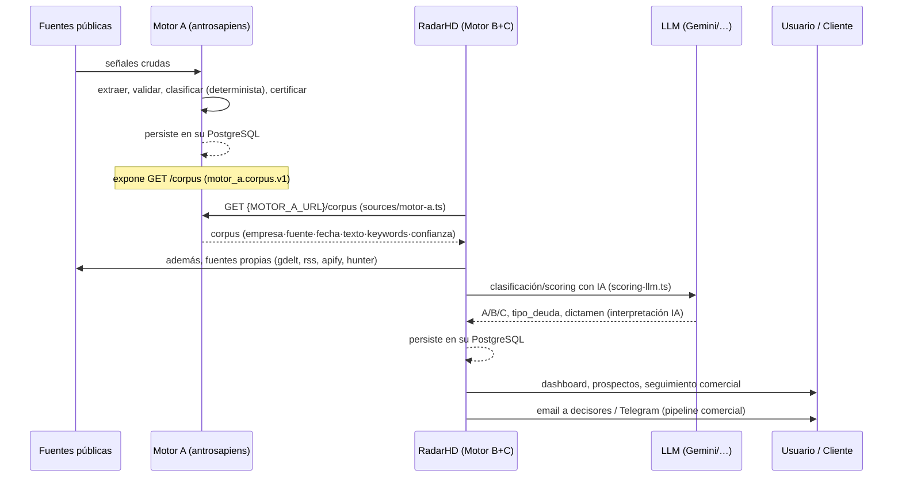
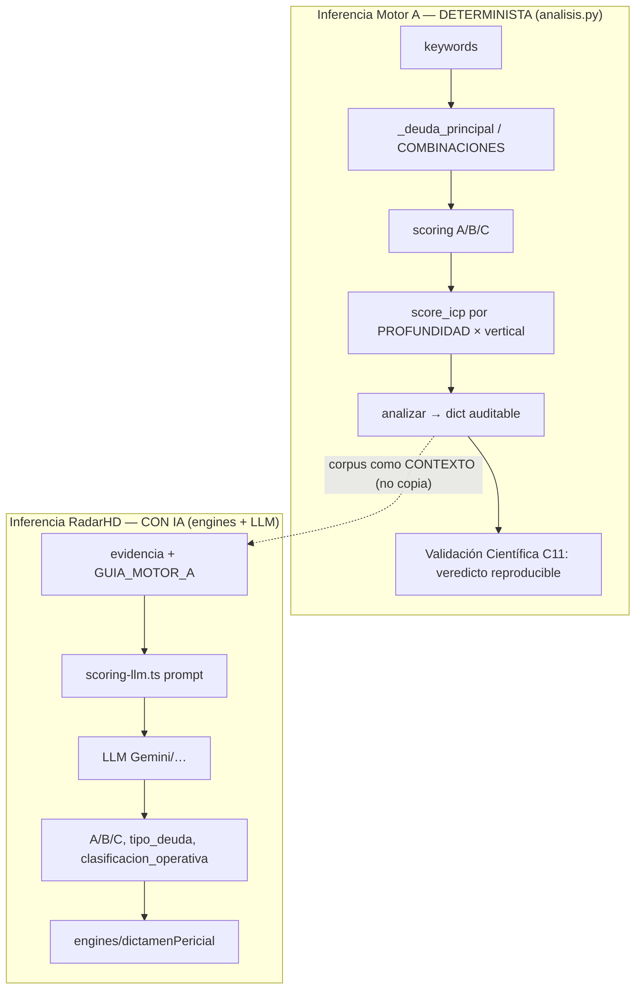
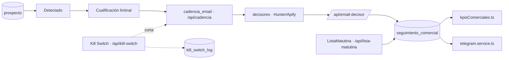
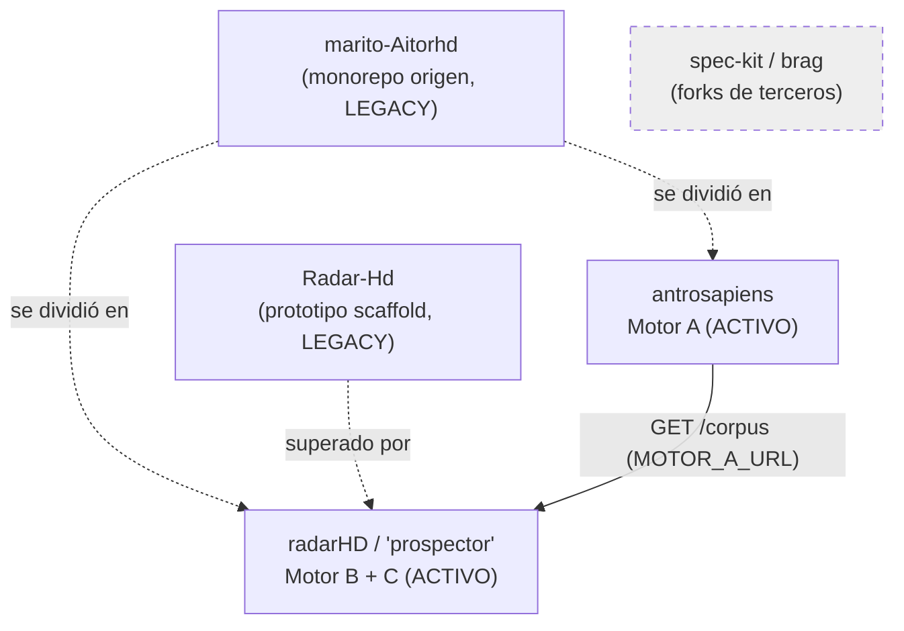
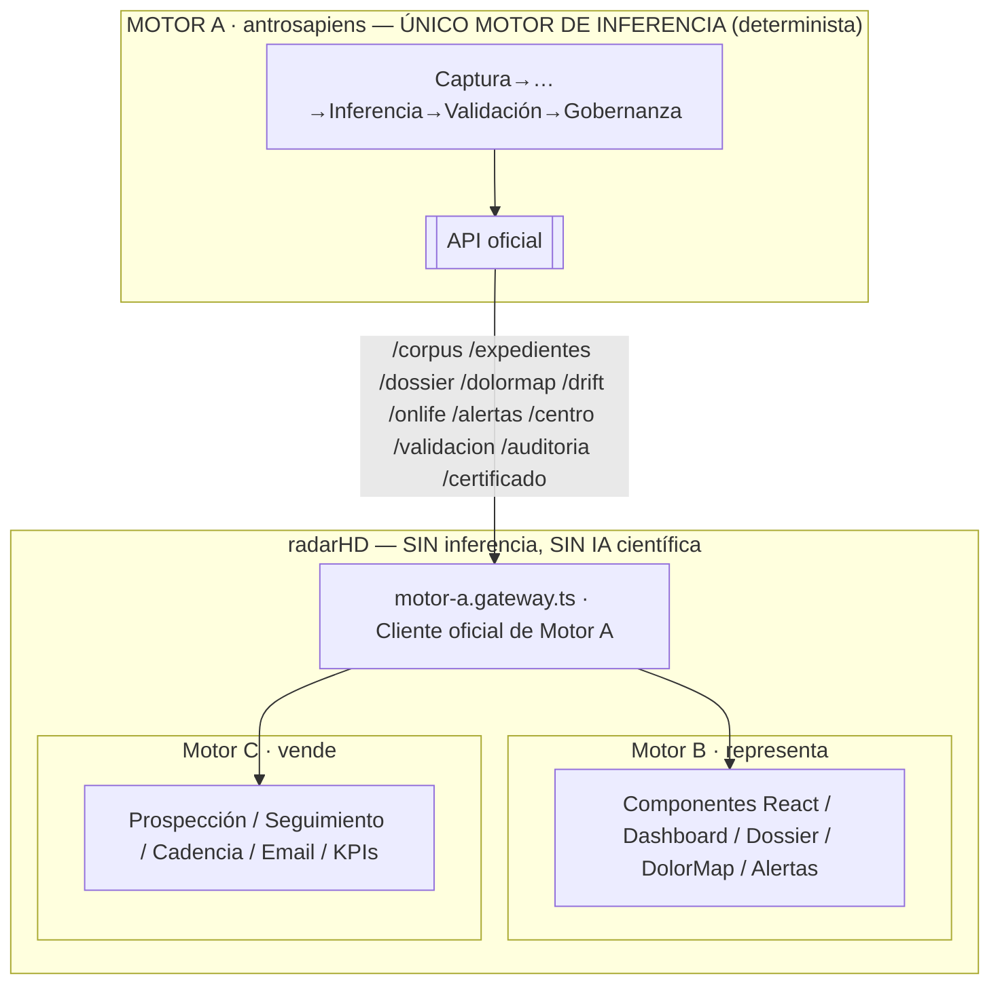

# ARQUITECTURA DEL ECOSISTEMA — Hamaca Digital

> **ARQUITECTURA 1.0 (oficial, ADR-0001):** *Motor A piensa. Motor B muestra.
> Motor C vende.* Un único Motor de Inferencia (A); RadarHD solo representa y
> vende, consumiendo la inteligencia de Motor A. Ver `ADR_0001_ARQUITECTURA_1_0.md`.
>
> Este documento describe el estado **verificado del código** (2026-07-25) — que
> incluye deuda a eliminar (RadarHD aún infiere con IA). Los diagramas §1–§6
> reflejan el estado ACTUAL; el estado OBJETIVO 1.0 está en §7 y en el ADR.
> Repos auditados: `Aitor-1977/antrosapiens` (Motor A) y `Aitor-1977/radarHD`
> (Motor B + Motor C). Repos legacy: `Radar-Hd`, `marito-Aitorhd`.

## 0. Repositorios reales del ecosistema

| Repo | Rol real (verificado) | Stack | Estado | Deploy |
|------|-----------------------|-------|--------|--------|
| `Aitor-1977/antrosapiens` | **Motor A** — extracción, inferencia determinista, validación, gobernanza | Python 3.11 + FastAPI | **ACTIVO** | `hd-prospector.vercel.app` |
| `Aitor-1977/radarHD` (npm `prospector`) | **Motor B + Motor C** — render/dashboard **y** prospección/pipeline comercial, con IA | Next.js 16 + React 19 + TS + Capacitor | **ACTIVO** | Vercel + APK Android |
| `Aitor-1977/Radar-Hd` | Prototipo scaffold de RadarHD (Google AI Studio) | Vite/React (`react-example`) | **LEGACY / ABANDONADO** (1 commit, 2026-06-16) | — |
| `Aitor-1977/marito-Aitorhd` | Monorepo de **origen**: `hd-scraper/` (Motor A embrionario) + frontend | Python + Vite/React | **LEGACY / ORIGEN** (2026-07-23) | — |
| `Aitor-1977/spec-kit`, `Aitor-1977/brag` | Forks públicos de terceros | — | **AJENO al ecosistema** | — |

**Hallazgo central:** **NO existe un repositorio independiente para Motor C.**
El "Prospector HD" (Motor C) vive **dentro de `radarHD`** — de hecho el
`package.json` de RadarHD se llama literalmente `"prospector"`
(`radarHD/package.json`). Motor B (render) y Motor C (comercial) son **la misma
aplicación Next.js**.

---

## 1. Arquitectura completa

> ⚠️ Motor A y RadarHD tienen **bases de datos PostgreSQL separadas**. RadarHD
> **no** escribe en la BD de Motor A; consume su `/corpus` como una fuente más.

---

## 2. Comunicación entre motores

**Único punto de integración verificado A→B/C:** `radarHD/src/lib/sources/
motor-a.ts` → `GET {MOTOR_A_URL}/corpus` (`MOTOR_A_URL=https://hd-prospector.
vercel.app`). **RadarHD NO consume** las Capas 11–18 de Motor A (`/validacion`,
`/auditoria`, `/certificado`, `/dossier`, `/laboratorio`): reimplementa su propio
dictamen/scoring/drift/onlife/ecosistema con IA. → ver FRONTERAS_MOTORES.md.

---

## 3. Flujo de datos

```mermaid
flowchart LR
    N[Noticia / señal pública] --> C{¿por qué vía?}
    C -->|Motor A| A1[connector.search] --> A2[normalize + hash_dedup] --> A3[detectar_keywords + confianza]
    A3 --> A4[validator: contrato] --> A5[(evidencias estado=ok)]
    A5 --> A6[_construir_expedientes + analizar] --> A7[validación + gobernanza] --> A8[GET /corpus]
    C -->|RadarHD| B1[sources/*: gdelt/rss/apify] --> B2[prefiltro] --> B3[scoring-llm con IA]
    A8 -->|opcional, fuente preferida| B2
    B3 --> B4[(prospecto / senal_radar / organizacion)] --> B5[UI + pipeline comercial]
```

Ejemplo real (verificado): una noticia de churn de "Nubank" → Motor A la extrae,
la marca `friccion_retencion`, la valida (veredicto) y la publica en `/corpus`.
RadarHD la toma vía `sources/motor-a.ts`, la reclasifica con LLM
(`scoring-llm.ts`, `GUIA_MOTOR_A`) y la convierte en `prospecto` con seguimiento.

---

## 4. Flujo de inferencia (dos inferencias distintas)

**Clave:** son **dos motores de inferencia paralelos**. Motor A infiere de forma
**determinista y sin IA** (auditable). RadarHD infiere con **LLM** (interpretación
no determinista) usando el corpus de A como contexto. Esto respeta la frontera
"sin IA en Motor A", pero **duplica conceptualmente** la inferencia entre motores
(dictamen, scoring, drift, onlife, ecosistema existen en ambos). → INCONSISTENCIAS.

---

## 5. Flujo comercial (Motor C, dentro de RadarHD)

Componentes reales: `SeguimientoComercial.tsx`, `KillSwitchModal.tsx`,
`ListaMatutina.tsx`, `Prospectos.tsx`, `ProspeccionMasiva.tsx`. Servicios:
`decisores.service.ts`, `email-finder.service.ts`, `telegram.service.ts`,
`contactos.service.ts`. Tablas: `prospecto`, `seguimiento_comercial`,
`cadencia_email`, `kill_switch_log`, `exclusion_permanente`.

**Este flujo NO existe en Motor A** (Motor A no ejecuta acción comercial). El
`pipeline_comercial.py` de Motor A es un modelo de etapas vestigial (→ FRONTERAS).

---

## 6. Dependencias entre repositorios

- **Acoplamiento A→(B+C):** débil y unidireccional — solo `GET /corpus` por HTTP,
  configurado con `MOTOR_A_URL`. Si no se configura, RadarHD funciona con sus
  otras fuentes (`radar/run/route.ts`: "Si MOTOR_A_URL no está configurada,
  fetchMotorA se salta").
- **Sin dependencia inversa:** Motor A no conoce ni llama a RadarHD.
- **Legacy:** `Radar-Hd` y `marito-Aitorhd` no participan en producción.

---

## 7. Estado OBJETIVO — Arquitectura 1.0 (ADR-0001)

Diferencia con el estado actual (§1): desaparecen de RadarHD los *engines* de
inferencia, los servicios LLM y el cálculo local de Dolor/Drift/Onlife/Ecosistema/
Dictamen. **Todo** dato científico entra por el **gateway** desde Motor A.
Migración: `radarHD/MIGRACION_ARQUITECTURA_1_0.md`.

## Referencias
- Fronteras y responsabilidades definitivas → `FRONTERAS_MOTORES.md`
- Contrato `motor_a.corpus.v1` y superficies API → `CONTRATOS_API.md`
- Inventarios → `INVENTARIO_{COMPONENTES,ENDPOINTS,TABLAS}.md`
- Reconstrucción → `GUIA_RECONSTRUCCION_TOTAL.md`
- Estado y evolución → `ROADMAP_ARQUITECTONICO.md`
- Motor A en detalle → `DOCUMENTACION_MAESTRA.md`
