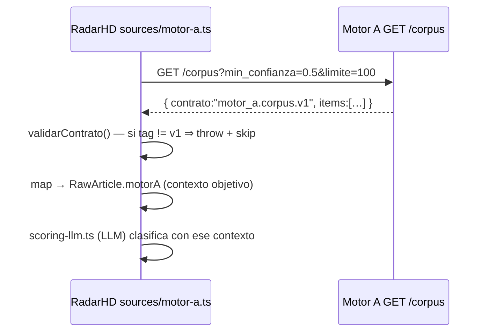

# CONTRATOS DE API — Ecosistema Hamaca Digital

> Verificado en el código de ambos lados (2026-07-25):
> productor `antrosapiens/hd_scraper/api/app.py:292` (`GET /corpus`) y consumidor
> `radarHD/src/lib/sources/motor-a.ts`.

## 1. Contrato de integración A → (B+C): `motor_a.corpus.v1`

**Único punto de acoplamiento verificado entre motores.** Motor A publica hechos
objetivos; RadarHD los consume como **contexto** para su propia clasificación con IA.

### 1.1 Productor — `GET /corpus` (Motor A)
Parámetros (query): `empresa`, `categoria` (VC|Startup|Incubadora|Corporativo),
`tipo_evento`, `min_confianza` (0–1), `desde`, `hasta` (ISO 8601),
`limite` (1–1000, def. 100), `offset`. Solo sirve `estado='ok'`.

Respuesta:
```json
{
  "contrato": "motor_a.corpus.v1",
  "total": 128, "limite": 100, "offset": 0,
  "items": [
    {
      "empresa": "Nubank", "fuente": "Bloomberg Línea",
      "fecha": "2026-07-01", "texto": "…churn…", "url": "https://…",
      "keywords": ["friccion_retencion"], "confianza": 0.8,
      "calidad_captura": "Alta", "categoria": "Startup",
      "tipo_evento": "queja", "hash": "…"
    }
  ]
}
```
**Lo que el contrato NO incluye (por diseño):** Deuda Cultural™, score ICP,
hipótesis. Cita literal del código: *"NO incluye Deuda Cultural™, Interés ni
hipótesis: eso lo aplica el Motor B (RadarHD)"* (`app.py:292`).

### 1.2 Consumidor — `sources/motor-a.ts` (RadarHD)
- URL: `MOTOR_A_URL` (o `HD_PROSPECTOR_URL`); si falta, **la fuente se salta**
  silenciosamente (la corrida sigue con GDELT/RSS/Apify).
- **Validación de contrato:** si `contrato !== "motor_a.corpus.v1"` → **lanza** y
  salta la fuente (no ingiere formas desconocidas). `CONTRATO_CORPUS` constante.
- Filtros por defecto: `MOTOR_A_MIN_CONFIANZA=0.5`, `MOTOR_A_LIMITE=100`.
- Mapea cada item a `RawArticle` arrastrando las señales objetivas en `motorA`;
  **RadarHD no re-adivina** lo ya extraído, lo usa como contexto del scoring-LLM.
- **Versionado aditivo:** `calidad_captura` se documenta como *"extensión aditiva
  del contrato v1"* → cambios compatibles no rompen el consumidor.

### 1.3 Diagrama del contrato


## 2. Superficie API de Motor A (72 endpoints, solo lectura)
Inventario completo → `INVENTARIO_ENDPOINTS.md` §A. Contrato principal expuesto:
`/corpus`. El resto (`/expedientes`, `/validacion`, `/certificado`, `/dossier`,
`/laboratorio`, …) **está disponible pero RadarHD hoy NO lo consume** (solo usa
`/corpus`). Oportunidad de integración → `ROADMAP_ARQUITECTONICO.md`.

## 3. Superficie API de RadarHD (49 rutas `/api/*`, internas de la app)
Son rutas **internas** del Next.js (consumidas por su propia UI y crons), **no**
un contrato público para Motor A (Motor A no llama a RadarHD). Inventario completo
→ `INVENTARIO_ENDPOINTS.md` §B. Grupos:
- **radar/**: motor de inteligencia propio (ecosistema, dictamen, drift, onlife,
  organizaciones, senales, oportunidades, prioridades, recomendaciones, run, cron).
- **comercial**: `cadencia`, `seguimiento`, `email-decisor`, `kill-switch`,
  `lista-matutina`, `decisores`, `prospeccion`.
- **soporte**: `dashboard/metricas`, `informes`, `enriquecer`, `dictamen`,
  `diag/*` (gemini, ia, drift, sitio), `sow`, `tarjeta`.

### 3.1 Autenticación / seguridad de RadarHD (verificado en `.env.example`)
`CRON_SECRET` (protege crons), claves LLM (`GEMINI_API_KEY`, `NVIDIA_API_KEY`,
`ANTHROPIC_API_KEY`, `ZENMUX_API_KEY`), `HUNTER_API_KEY`, `APIFY_API_KEY`,
`TELEGRAM_BOT_TOKEN`/`TELEGRAM_CHAT_ID`, `DATABASE_URL` (PostgreSQL propia).

## 4. Reglas del contrato (gobernanza de compatibilidad)
1. El tag `motor_a.corpus.v1` es el **candado**: cambios incompatibles exigen
   `v2` (el consumidor rechaza tags desconocidos).
2. Extensiones **aditivas** (nuevos campos opcionales) son compatibles
   (`calidad_captura` es el precedente).
3. Motor A **nunca** debe meter interpretación (Deuda/ICP/hipótesis) en `/corpus`.

## Referencias
- Fronteras → `FRONTERAS_MOTORES.md` · Endpoints → `INVENTARIO_ENDPOINTS.md` ·
  Tablas → `INVENTARIO_TABLAS.md` · Arquitectura → `ARQUITECTURA_ECOSISTEMA.md`.
