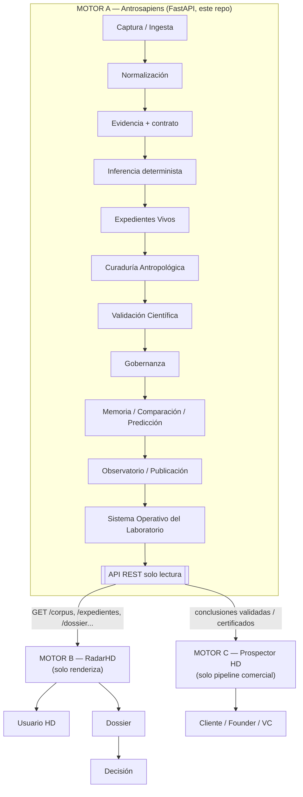
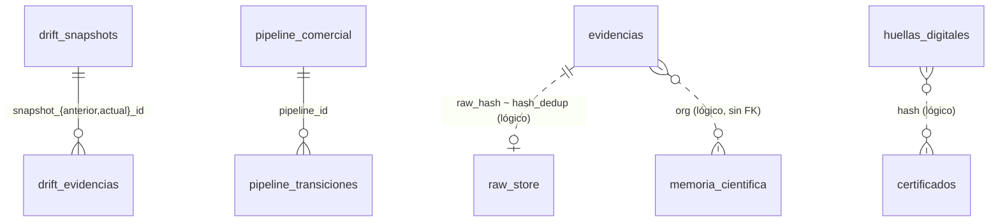

# DOCUMENTACIÓN MAESTRA — Ecosistema Hamaca Digital

> **Documento maestro del proyecto.** Fuente única de verdad: el código del
> repositorio `aitor-1977/antrosapiens` (Motor A) presente en la sesión.
> Estado documentado: **tras la Capa 18**. Fecha de generación: **2026-07-25**.
> Toda afirmación se ancla en `archivo.py:línea`. Lo no verificable desde el
> código se marca explícitamente.
>
> **Leyenda de estado:** `[IMPLEMENTADO]` · `[PARCIAL]` · `[DEPRECADO]` ·
> `[PENDIENTE]` · `[NO IMPLEMENTADO]` · `[NO VERIFICABLE — repo ausente]`.

## Índice

1. [Resumen ejecutivo](#1-resumen-ejecutivo)
2. [Filosofía del laboratorio](#2-filosofía-del-laboratorio)
3. [Arquitectura general](#3-arquitectura-general)
4. [Arquitectura por capas (0–18)](#4-arquitectura-por-capas-0-18)
5. [Motor A — Antrosapiens](#5-motor-a--antrosapiens)
6. [Motor B — RadarHD](#6-motor-b--radarhd)
7. [Motor C — Prospector HD](#7-motor-c--prospector-hd)
8. [APIs (72 endpoints)](#8-apis-72-endpoints)
9. [Base de datos (20 tablas)](#9-base-de-datos-20-tablas)
10. [Flujo de datos extremo a extremo](#10-flujo-de-datos-extremo-a-extremo)
11. [Curaduría Antropológica (Capa 10)](#11-curaduría-antropológica-capa-10)
12. [Motor de Inferencia (Capa 3)](#12-motor-de-inferencia-capa-3)
13. [Validación Científica (Capa 11)](#13-validación-científica-capa-11)
14. [Interfaces HTML servidas por Motor A](#14-interfaces-html-servidas-por-motor-a)
15. [Backend / servicios](#15-backend--servicios)
16. [Testing](#16-testing)
17. [Infraestructura](#17-infraestructura)
18. [Seguridad](#18-seguridad)
19. [Convenciones del proyecto](#19-convenciones-del-proyecto)
20. [Roadmap](#20-roadmap)
21. [Guía de recuperación total](#21-guía-de-recuperación-total)
22. [Glosario](#22-glosario)
23. [Anexos](#23-anexos)
24. [Inconsistencias detectadas](#24-inconsistencias-detectadas)

---

## 1. Resumen ejecutivo

**Hamaca Digital (HD)** es un laboratorio de antropología de la innovación. Su
ecosistema técnico se organiza en tres motores con responsabilidad única (SRP):

| Motor | Nombre | Rol | Stack | Estado en esta doc |
|-------|--------|-----|-------|--------------------|
| **A** | **Antrosapiens** | Extracción de evidencia, inferencia determinista, validación científica y gobernanza | Python 3.11 + FastAPI, SQLite/PostgreSQL | `[IMPLEMENTADO]` — repo `antrosapiens` |
| **B** | **RadarHD** (render) | Dashboard, visualizaciones, paneles | Next.js 16 + React 19 + TS | `[IMPLEMENTADO]` — repo `radarHD` |
| **C** | **Prospector HD** (comercial) | Prospección, seguimiento, cadencia, kill-switch, email a decisores | **dentro de** `radarHD` (npm `prospector`) | `[IMPLEMENTADO]` — **NO es repo aparte** |

> **Actualización 2026-07-25 (auditoría del ecosistema):** se verificaron los
> repositorios reales. Motor B y Motor C **son la misma aplicación** (`radarHD`,
> npm `"prospector"`); **no existe repo independiente de Motor C**. RadarHD, además
> de renderizar, hace **inferencia con IA (LLM)** y ejecuta el **pipeline
> comercial**. Detalle completo en `ARQUITECTURA_ECOSISTEMA.md`,
> `FRONTERAS_MOTORES.md`, `CONTRATOS_API.md` e inventarios. Ver §6, §7 y §24.

**Problema que resuelve Motor A:** convertir señales públicas dispersas sobre
organizaciones (prensa, feeds, job boards, actividad onlife) en **evidencia
estructurada, trazable, clasificada de forma determinista y científicamente
auditable**, sin intervención de IA generativa.

**Propósito:** ser la *capa de verdad* del ecosistema. Motor B consume su corpus
para renderizar; Motor C consume sus conclusiones validadas para el pipeline
comercial. Motor A **jamás** ejecuta acción comercial ni usa LLM.

**Repositorios reales del ecosistema (verificados 2026-07-25):**
- `Aitor-1977/antrosapiens` → **Motor A** (Python/FastAPI) — documentado aquí.
- `Aitor-1977/radarHD` (npm `prospector`) → **Motor B + Motor C** (Next.js) — §6, §7.
- `Aitor-1977/Radar-Hd` → prototipo scaffold **LEGACY** (abandonado).
- `Aitor-1977/marito-Aitorhd` → monorepo de **origen LEGACY** (hd-scraper + front).
- `Aitor-1977/spec-kit`, `brag` → forks de terceros, **ajenos** al ecosistema.

Ecosistema completo documentado en: `ARQUITECTURA_ECOSISTEMA.md`,
`FRONTERAS_MOTORES.md`, `CONTRATOS_API.md`, `INVENTARIO_{COMPONENTES,ENDPOINTS,
TABLAS}.md`, `GUIA_RECONSTRUCCION_TOTAL.md`, `ROADMAP_ARQUITECTONICO.md`.

**Estado global (verificado):** paquete `hd_scraper/` con **30 módulos** en la
raíz (29 funcionales + `__init__`) más subpaquetes,
**72 endpoints** en `hd_scraper/api/app.py`, **20 tablas**, **42 archivos de
test**, suite `657 passed` y cobertura global **90%** (núcleo científico
Capas 10–18 al **100%**; lo no cubierto es el *wiring* HTTP/HTML de `app.py` y
conectores de red no ejecutables en el entorno con proxy). → §16.

---

## 2. Filosofía del laboratorio

Fuente normativa: `CLAUDE.md` (raíz del repo).

### Frontera Motor A / Motor B (INVIOLABLE)
- **Motor A es objetivo:** scraping, limpieza, extracción, dedup y señales
  Nivel 1 con taxonomía **genérica/pública** (ronda, despidos, churn, expansión,
  liderazgo, lanzamiento, adquisición). Emite el corpus por `GET /corpus`
  (contrato `motor_a.corpus.v1`). Ref: `CLAUDE.md` §"Frontera Motor A / Motor B".
- La **Deuda Cultural™**, el **score ICP** y las **hipótesis condicionales** son
  IP de HD. Por decisión del operador (2026-07-22, sección "Frontera de
  Interpretación"), Motor A **sí puede** clasificar de forma **determinista y
  auditable** sobre datos ya extraídos (scoring A/B/C, ICP 0–100, clasificación
  preliminar de Dolor Cultural), pero **nunca** decidir ni ejecutar acción
  comercial. Implementación de esa frontera: `hd_scraper/analisis.py` y
  `hd_scraper/engine/rule_engine.py`.

### No negociables
1. **Sin IA generativa / sin LLM** en Motor A. Toda interpretación es
   determinista (mismo insumo ⇒ mismo resultado).
2. **Sin aleatoriedad no auditable.** Las fechas de emisión son metadato y no
   entran en los hashes (Capa 12).
3. **La evidencia nunca se escribe por API.** Solo entra por el pipeline de
   captura o `POST /webhook/ingesta`. La API es **solo lectura** salvo el intake
   de *prospectos* (con token) y disparadores de corrida.
4. **El validador es el único guardián del contrato** de `evidencias`
   (`hd_scraper/validation/validator.py`). Registro incompleto → `rechazos`.

### Qué jamás debe hacer cada motor
- **Motor A:** puntuar con criterio libre, resumir con juicio, inferir el tipo
  de evento leyendo el texto (es estructural), ejecutar contacto comercial, usar
  Gemini/LLM, servir dashboards de decisión comercial.
- **Motor B:** producir inteligencia o alterar el corpus (solo renderiza).
- **Motor C:** generar evidencia o hipótesis (solo gestiona el pipeline comercial).

---

## 3. Arquitectura general



**Interacciones:**
- **Captura → API:** Motor A ingiere señales, las valida contra el contrato, las
  clasifica determinísticamente, las valida científicamente y las sella con
  huella/certificado. Expone todo por HTTP **solo lectura**.
- **API → Motor B:** RadarHD **lee** (`GET /corpus`, `/expedientes`, `/dossier`,
  `/laboratorio`…) y **renderiza**. No escribe ni interpreta.
- **API → Motor C:** el pipeline comercial consume las conclusiones **validadas**
  (veredicto/certificado) para decidir seguimiento. La decisión y ejecución son
  exclusivas de Motor C.
- **Usuario → Cliente → Dossier → Decisión:** el flujo de negocio parte de lo que
  Motor A certifica; el dossier (`GET /dossier/{org}`) es el artefacto puente.

> ⚠️ En el repositorio de Motor A existe `hd_scraper/pipeline_comercial.py`
> (tabla `pipeline_comercial`) que **modela etapas comerciales**. Esto **cruza**
> la frontera declarada (el pipeline comercial "es de Motor C"). Ver §24.

---

## 4. Arquitectura por capas (0–18)

Numeración **autoritativa** (código): `hd_scraper/laboratorio.py:19` (`CAPAS`).
El brief histórico usaba una numeración 1–11 distinta; mapa de equivalencia
al final de la sección.

| # | Capa | Módulo(s) principal(es) | Estado |
|---|------|-------------------------|--------|
| 0 | Captura e Ingesta | `ingesta/`, `connectors/`, `signals.py` | `[IMPLEMENTADO]` |
| 1 | Normalización | `db/models.py`, `pipeline.py` | `[IMPLEMENTADO]` |
| 2 | Evidencia (contrato) | `validation/validator.py`, `db/models.py` | `[IMPLEMENTADO]` |
| 3 | Inferencia Antropológica | `analisis.py`, `engine/rule_engine.py` | `[IMPLEMENTADO]` |
| 4 | Relevancia y Señales | `relevance.py`, `signals.py` | `[IMPLEMENTADO]` |
| 5 | Enriquecimiento | `enrich.py`, `contacto.py`, `directorio.py`, `hunter.py` | `[IMPLEMENTADO]` |
| 6 | Drift Narrativo | `drift.py`, `drift_compare.py` | `[IMPLEMENTADO]` |
| 7 | Onlife | `onlife.py` | `[IMPLEMENTADO]` |
| 8 | Pipeline Comercial | `pipeline_comercial.py` | `[IMPLEMENTADO]` (frontera → §24) |
| 9 | Dolor Cultural / DolorMap | `analisis.py` + endpoint `/dolormap` | `[IMPLEMENTADO]` |
| 10 | Curaduría Antropológica | `curaduria.py` | `[IMPLEMENTADO]` |
| 11 | Validación Científica | `validacion_cientifica.py` | `[IMPLEMENTADO]` |
| 12 | Gobernanza Científica | `gobernanza.py`, `gobernanza_store.py` | `[IMPLEMENTADO]` |
| 13 | Memoria Científica | `memoria.py`, `memoria_store.py` | `[IMPLEMENTADO]` |
| 14 | Comparador Temporal y Ecosistémico | `comparador.py` | `[IMPLEMENTADO]` |
| 15 | Motor Predictivo Antropológico | `predictivo.py` | `[IMPLEMENTADO]` |
| 16 | Observatorio LATAM | `observatorio.py` | `[IMPLEMENTADO]` |
| 17 | Publicador Científico | `publicador.py` | `[IMPLEMENTADO]` |
| 18 | Sistema Operativo del Laboratorio | `laboratorio.py` | `[IMPLEMENTADO]` |

**Mapa brief histórico (1–11) ↔ numeración real:** 1 Sensores → C0/C4 · 2
Normalización → C1 · 3 Evidencia → C2 · 4 Clasificación → C3 · 5 Expedientes
Vivos → `_construir_expedientes` (app.py, no es capa numerada) · 6 Drift → C6 ·
7 Onlife → C7 · 8 Dolor Cultural → C9 · 9 Pipeline Comercial → C8 · 10 Curaduría
→ C10 · 11 Validación → C11.

Ficha por capa (objetivo · entrada → proceso → salida · funciones · endpoints ·
archivos · tests · ejemplo):

### Capa 0 — Captura e Ingesta `[IMPLEMENTADO]`
- **Objetivo/Responsabilidad:** traer señales públicas crudas de fuentes.
- **Entrada:** `QuerySpec` (empresa, tipo_evento, categoría). **Proceso:**
  `connector.search()` por fuente. **Salida:** `RawItem`s.
- **Funciones/Clases:** `connectors/base.py:Connector` (`search/fetch/normalize/
  validate`); `REGISTRY` = `google_news`, `gdelt`, `rss_fijos`, `job_boards`
  (`connectors/__init__.py:24`). Ingesta gratuita: `ingesta/noticias.py`,
  `ingesta/youtube.py`, `ingesta/webhook.py`.
- **Endpoints:** `POST /webhook/ingesta`, `POST /ingesta/noticias`,
  `GET /senales-capa0`. **Tests:** `test_google_news`, `test_gdelt`,
  `test_rss_fijos`, `test_job_boards`, `test_ingesta_connectors`.

### Capa 1 — Normalización `[IMPLEMENTADO]`
- Normaliza URL/empresa/título y calcula hashes de dedup.
- **Funciones:** `db/models.py`: `normalizar_url`, `normalizar_empresa`,
  `normalizar_titulo`, `hash_contenido`, `clave_contenido`,
  `calcular_hash_dedup`. **Tests:** `test_models`.

### Capa 2 — Evidencia (contrato) `[IMPLEMENTADO]`
- Guardián único del contrato de `evidencias`.
- **Entrada:** `EvidenceRecord`. **Proceso:** `validation/validator.py` valida
  campos obligatorios; incompleto → `rechazos`; sin fecha → `no_fechado`.
- **Contrato (obligatorios):** `cita_textual, fecha_extraccion, url_fuente,
  nombre_medio, empresa_mencionada, tipo_evento` (`ronda|contratacion|despido|
  lanzamiento|queja|cambio_sitio`), `origen_declaracion` (`operador|inversor|
  prensa|usuario`), `hash_dedup`. **Tests:** `test_validator`.

### Capa 3 — Inferencia Antropológica `[IMPLEMENTADO]` → detalle §12
- `analisis.py:analizar()`. Salida: scoring A/B/C, `tipo_deuda`, `score_icp`,
  `profundidad_dolor`, `viabilidad`, `decisor`, `razon`. **Tests:** `test_analisis`,
  `test_rule_engine`.

### Capa 4 — Relevancia y Señales `[IMPLEMENTADO]`
- `relevance.py`: `detectar_empresa`, `es_opinion`, `evaluar_relevancia`,
  `calcular_calidad`. `signals.py`: `detectar_keywords`, `fuente_confiable`,
  `calcular_confianza`. **Tests:** `test_relevance`, `test_signals`.

### Capa 5 — Enriquecimiento `[IMPLEMENTADO]`
- `enrich.py`: `resolver_sitio`, `extraer_discurso`, `sugerir_vertical`,
  `enriquecer`, `linkedin_search_url`, `google_search_url`. `contacto.py`,
  `directorio.py` (Wikidata + `directorio_cache`), `hunter.py`.
- **Endpoints:** `POST /enrich`, `POST /verificar-contacto`, `POST /directorio`.
  **Tests:** `test_enrich`, `test_contacto`, `test_directorio`, `test_hunter`.

### Capa 6 — Drift Narrativo `[IMPLEMENTADO]`
- Snapshots versionados del discurso público; compara consecutivos y emite
  evidencias narrativas (hechos, no interpretación).
- **Funciones:** `drift.py`: `capturar_snapshot`, `obtener_timeline`;
  `drift_compare.py`. **Tablas:** `drift_snapshots`, `drift_evidencias`.
- **Endpoints:** `POST /drift/capturar`, `GET /drift/{org}`. **Tests:**
  `test_drift`, `test_drift_compare`.

### Capa 7 — Onlife `[IMPLEMENTADO]`
- Señales conductuales en GitHub / Hacker News / blogs-changelog.
- **Funciones:** `onlife.py`: `observar_github`, `observar_hackernews`,
  `observar_blog`, `observar`, `persistir_señales`, `obtener_perfil`.
- **Tabla:** `onlife_signals`. **Endpoints:** `POST /onlife/observar`,
  `GET /onlife/{org}`. **Tests:** `test_onlife`.

### Capa 8 — Pipeline Comercial `[IMPLEMENTADO]` (frontera → §24)
- Modela etapas del embudo (`observacion`→…→cerrado) y transiciones.
- **Funciones:** `pipeline_comercial.py`: `registrar_org`, `avanzar`,
  `obtener_pipeline`, `listar_pipeline`, `resumen_funnel`.
- **Tablas:** `pipeline_comercial`, `pipeline_transiciones`. **Endpoints:**
  `POST /pipeline/registrar`, `POST /pipeline/avanzar`, `GET /pipeline`,
  `GET /pipeline/funnel`, `GET /pipeline/{org}`. **Tests:** `test_pipeline_comercial`.

### Capa 9 — Dolor Cultural / DolorMap `[IMPLEMENTADO]`
- Vista consolidada por organización (evidencias + drift + onlife + pipeline +
  análisis). **Endpoint:** `GET /dolormap/{org}`. **Tests:** `test_dolormap`.

### Capa 10 — Curaduría Antropológica `[IMPLEMENTADO]` → detalle §11
- `curaduria.py:curar()`. **Tests:** `test_curaduria`.

### Capa 11 — Validación Científica `[IMPLEMENTADO]` → detalle §13
- `validacion_cientifica.py` (14 funciones). **Endpoint:** `GET /validacion/{org}`.
  **Tests:** `test_validacion_cientifica` (46).

### Capa 12 — Gobernanza Científica `[IMPLEMENTADO]`
- **Objetivo:** toda conclusión auditable/reproducible/explicable.
- **Funciones (14 puras):** `gobernanza.py`: `registrar_version_{modelo,
  taxonomia,corpus,pipeline,expediente}`, `generar_huella_digital`,
  `validar_integridad`, `verificar_consistencia`, `comparar_versiones`,
  `construir_linea_tiempo`, `registrar_decision`, `generar_bitacora`,
  `firmar_motor`, `emitir_certificado`, `auditar_expediente`. Persistencia:
  `gobernanza_store.py` (`persistir_*`).
- **Tablas:** `versionado_modelo`, `huellas_digitales`, `bitacora_decisiones`,
  `auditoria_expedientes`, `certificados`. **Endpoints:** `GET /auditoria/{org}`,
  `GET /certificado/{org}`. **Tests:** `test_gobernanza` (34).
- **Reproducibilidad:** la fecha de emisión no entra en el hash (verificado).

### Capa 13 — Memoria Científica `[IMPLEMENTADO]`
- Historial **inmutable** (append-only, nunca sobrescribe).
- **Funciones:** `memoria.py`: `crear_version`, `comparar_versiones`,
  `detectar_cambios`, `construir_timeline`, `calcular_evolucion`,
  `emitir_historial`. Persistencia: `memoria_store.py`: `guardar_version`
  (dedup por hash), `recuperar_historial`.
- **Tabla:** `memoria_cientifica` (`UNIQUE(org_nombre, version_num)`).
- **Endpoints:** `GET /historial/{org}`, `/timeline/{org}`, `/versiones/{org}`.
  `/auditoria` registra una versión. **Tests:** `test_memoria` (17).

### Capa 14 — Comparador Temporal y Ecosistémico `[IMPLEMENTADO]`
- **Funciones (10):** `comparador.py`: `comparar_organizaciones|ecosistemas|
  periodos|patrones|narrativas|dolor|validaciones`, `detectar_convergencias|
  divergencias`, `generar_matriz`. **Endpoints:** `GET /comparar`,
  `/ecosistema/comparar`, `/periodos`. **Tests:** `test_comparador` (15).

### Capa 15 — Motor Predictivo Antropológico `[IMPLEMENTADO]`
- Proyección determinista (mínimos cuadrados + banda de volatilidad).
- **Funciones (8 + serie):** `predictivo.py`: `calcular_tendencia|estabilidad|
  volatilidad|madurez`, `proyectar_escenarios`, `estimar_riesgo`,
  `detectar_inflexiones`, `emitir_proyeccion`, `serie_temporal`. **Endpoints:**
  `GET /proyeccion/{org}`, `/escenarios/{org}`. **Tests:** `test_predictivo` (23).

### Capa 16 — Observatorio LATAM `[IMPLEMENTADO]`
- **Funciones (7):** `observatorio.py`: `analizar_region|vertical|ecosistema`,
  `identificar_patrones_regionales|tensiones`, `calcular_indicadores`,
  `emitir_reporte_regional`. Reutiliza `dictamen.generar_ranking` y
  `predictivo.estimar_riesgo`. **Endpoints:** `GET /latam`, `/latam/{pais}`,
  `/vertical/{nombre}`. **Tests:** `test_observatorio` (13).

### Capa 17 — Publicador Científico `[IMPLEMENTADO]`
- Documentos (peritaje/informe) JSON/CSV/HTML/PDF desde evidencia **validada**,
  firmados. **Funciones (7):** `publicador.py`: `generar_peritaje|informe|pdf|
  html|json|csv`, `firmar_documento`. **Endpoints:** `GET /publicar/peritaje/
  {org}` (json|csv|html), `/publicar/informe/{org}`, `/publicar/pdf/{org}`.
  **Tests:** `test_publicador` (13).

### Capa 18 — Sistema Operativo del Laboratorio `[IMPLEMENTADO]`
- **Funciones (7):** `laboratorio.py`: `estado_general|capas|corpus|pipeline|
  validacion|gobernanza|observatorio`. **Endpoints:** `GET /laboratorio`,
  `/estado`, `/dashboard` (HTML). **Tests:** `test_laboratorio` (13).

---

## 5. Motor A — Antrosapiens

### 5.1 Árbol de carpetas
```
hd_scraper/
├── api/app.py            # 72 endpoints FastAPI (solo lectura) — 4436 LOC
├── analisis.py           # Capa 3 — inferencia determinista (analizar)
├── curaduria.py          # Capa 10 — curaduría antropológica
├── dictamen.py           # dictamen + ranking (Fase 2)
├── validacion_cientifica.py  # Capa 11 — 14 funciones puras
├── gobernanza.py / gobernanza_store.py  # Capa 12
├── memoria.py / memoria_store.py        # Capa 13
├── comparador.py         # Capa 14
├── predictivo.py         # Capa 15
├── observatorio.py       # Capa 16
├── publicador.py         # Capa 17
├── laboratorio.py        # Capa 18
├── drift.py / drift_compare.py  # Capa 6
├── onlife.py             # Capa 7
├── pipeline_comercial.py # Capa 8 (frontera → §24)
├── relevance.py / signals.py    # Capa 4
├── enrich.py / contacto.py / directorio.py / hunter.py  # Capa 5
├── pipeline.py           # orquestador search→normalize→validate→escribe
├── scheduler.py          # APScheduler (cada 12 h)
├── jobs.py               # cola de trabajos (tabla jobs, sin Redis)
├── discovery.py          # regiones/verticales/queries
├── prospectos.py         # upsert de prospectos
├── config.py             # settings (frozen dataclass, env vars)
├── connectors/           # base + google_news, gdelt, rss_fijos, job_boards
├── governance/           # health.py, rate_limit.py
├── storage/raw_store.py  # retención de crudo comprimido (90 días)
├── ingesta/              # conectores gratuitos (noticias, youtube, webhook)
├── engine/               # rule_engine.py, schemas.py
├── validation/validator.py  # guardián del contrato
└── db/                   # database.py, models.py, schema.sql, schema_postgres.sql
```

### 5.2 Módulos (responsabilidad y funciones públicas)

| Módulo | LOC | Funciones/entradas públicas | Capa |
|--------|-----|------------------------------|------|
| `analisis.py` | 386 | `analizar()` | 3/9 |
| `relevance.py` | 339 | `detectar_empresa`, `es_opinion`, `evaluar_relevancia`, `calcular_calidad` | 4 |
| `signals.py` | 80 | `detectar_keywords`, `fuente_confiable`, `calcular_confianza` | 4 |
| `enrich.py` | 321 | `resolver_sitio`, `extraer_discurso`, `sugerir_vertical`, `enriquecer`, `dominios_candidatos`, `elegir_sitio_oficial`, `linkedin_search_url`, `google_search_url` | 5 |
| `contacto.py` | — | `dominio_de`, `rutas_contacto` | 5 |
| `directorio.py` | — | descubrimiento vía Wikidata (cache `directorio_cache`) | 5 |
| `hunter.py` | 154 | verificación de contacto (Hunter API opcional) | 5 |
| `drift.py` | 220 | `capturar_snapshot`, `obtener_timeline`, `capturar_pagina`, `obtener_snapshot_anterior` | 6 |
| `drift_compare.py` | 245 | comparación de snapshots → evidencias narrativas | 6 |
| `onlife.py` | 379 | `observar`, `observar_github/hackernews/blog`, `persistir_señales`, `obtener_perfil` | 7 |
| `pipeline_comercial.py` | 216 | `registrar_org`, `avanzar`, `obtener_pipeline`, `listar_pipeline`, `resumen_funnel` | 8 |
| `curaduria.py` | 636 | `curar()` | 10 |
| `dictamen.py` | 357 | `generar_dictamen`, `generar_ranking` | 3/16 |
| `validacion_cientifica.py` | 605 | 14 funciones (§13) | 11 |
| `gobernanza.py` | 517 | 14 funciones (§4 C12) | 12 |
| `gobernanza_store.py` | 121 | `persistir_{versionado,huella,bitacora,auditoria,certificado,gobernanza}` | 12 |
| `memoria.py` / `_store.py` | 155/57 | §4 C13 | 13 |
| `comparador.py` | — | §4 C14 | 14 |
| `predictivo.py` | 194 | §4 C15 | 15 |
| `observatorio.py` | 135 | §4 C16 | 16 |
| `publicador.py` | 159 | §4 C17 | 17 |
| `laboratorio.py` | 140 | §4 C18 | 18 |
| `pipeline.py` | 224 | `run_connector()` | orquestación |
| `scheduler.py` | 65 | APScheduler cada `HD_SCHEDULE_HOURS` (12) | infra |
| `jobs.py` | 60 | cola en tabla `jobs` | infra |
| `discovery.py` | 144 | `REGIONES`, `VERTICALES_HD`, `queries_para`, `region_clause` | infra |
| `prospectos.py` | 94 | `nuevo_prospecto`, `upsert_prospecto` | intake |
| `config.py` | — | `settings` (§17) | infra |

### 5.3 Orquestación (`pipeline.py:run_connector`)
`search → normalize → (keywords + confianza + captura inteligente) → validate →
guardar crudo (raw_store) + escribir con dedup | rechazo`. La salud por fuente se
registra en `salud_fuentes` (2 fallos consecutivos ⇒ alerta,
`governance/health.py`). Rate-limit con backoff por fuente (`governance/rate_limit.py`).

### 5.4 `_construir_expedientes` (agregador central, `api/app.py`)
Agrupa evidencia OK por organización, corre `analizar()`, detecta patrones,
adjunta `validacion_cientifica` (Capa 11) y `gobernanza` (huella+integridad+
consistencia, Capa 12). Es el insumo de las Capas 14–18 vía el helper
`_paquete_cientifico(org)` → `(expediente, validación, huella)`.

---

## 6. Motor B — RadarHD (render)

**Estado: `[IMPLEMENTADO]`** — repo `Aitor-1977/radarHD` (auditado 2026-07-25).
Next.js 16 + React 19 + TypeScript + Capacitor (Android). `package.json` name:
`"prospector"`.

- **Pantallas/componentes (23 `.tsx`):** `Dashboard`, `Sidebar`, `Inteligencia`,
  `InteligenciaEcosistemica`, `IntelligencePanel`, `DictamenPanel`, `DriftPanel`,
  `SignalRelations`, `OrganizacionesObservadas`, `SenalesNuevas`, `FondosVC`,
  `InformesPanel`, `Banners`, `CualificacionLiminalModal`, `TarjetaProspectoHD`
  (+ los comerciales listados en §7). Página: `src/app/admin/dashboard/page.tsx`.
- **Cliente HTTP / API base:** `src/lib/api-base.ts` — `fetch(${API_BASE}/api/…)`;
  `API_BASE = NEXT_PUBLIC_API_BASE` (en APK apunta al backend remoto).
- **Cola / proxy:** `src/services/queue.service.ts`, `src/proxy.ts`.
- **Engines de inteligencia (13, `src/lib/engines/`):** `inference`, `scoring`,
  `dictamenPericial`, `contradiction`, `ecosistema`, `onlife`, `priorizacion`,
  `recomendacion`, `radar`, `concentrador`, `kpisComerciales`, `ritual`, `tarjeta`.
- **IA (LLM):** `src/lib/services/llm.ts`, `scoring-llm.ts` — Gemini / NVIDIA /
  Anthropic / ZenMux. Esta es la "IA generativa" que la frontera reserva a Motor B.
- **BD propia PostgreSQL** (14 tablas, `src/lib/db.ts`) — separada de Motor A.
- **Adaptador a Motor A:** `src/lib/sources/motor-a.ts` consume `GET /corpus`
  (`motor_a.corpus.v1`) como fuente **preferida** (no re-raspa lo ya extraído).

Inventarios completos: `INVENTARIO_COMPONENTES.md §B`, `INVENTARIO_ENDPOINTS.md §B`,
`INVENTARIO_TABLAS.md §B`. Fronteras: `FRONTERAS_MOTORES.md`.

---

## 7. Motor C — Prospector HD (pipeline comercial)

**Estado: `[IMPLEMENTADO]` — NO es un repositorio independiente.** Vive dentro de
`radarHD` (por eso el npm name es `"prospector"`). Verificado 2026-07-25.

- **Prospección/comercial (rutas):** `/api/prospeccion`, `/api/prospectos`,
  `/api/cadencia`, `/api/seguimiento`, `/api/kill-switch`, `/api/lista-matutina`,
  `/api/decisores`, **`/api/email-decisor`** (envía email a decisores).
- **Componentes:** `Prospectos.tsx`, `ProspeccionMasiva.tsx`,
  `SeguimientoComercial.tsx`, `ListaMatutina.tsx`, `RecomendacionesEstrategicas.tsx`,
  `KillSwitchModal.tsx`, `KillSwitchHistory.tsx`.
- **Servicios:** `email-finder.service.ts`, `decisores.service.ts`,
  `decisor-hunter.service.ts`, `contactos.service.ts`, `telegram.service.ts`.
- **Tablas (en la BD de RadarHD):** `prospecto`, `seguimiento_comercial`,
  `cadencia_email`, `kill_switch_log`, `exclusion_permanente`.
- **KPIs / cadencia / kill switch / Telegram:** `engines/kpisComerciales.ts`,
  `services/telegram.service.ts`; `TELEGRAM_BOT_TOKEN`, `CRON_SECRET`.

**Confirmación de la hipótesis del operador:** no existe un repo "Prospector HD"
separado. El Prospector **continúa formando parte de RadarHD**. Esto se documenta
explícitamente y **no se inventa** ninguna separación inexistente.

**Sobre `pipeline_comercial.py` de Motor A:** modela un embudo pero **no ejecuta**
contacto (sin envío de emails en el código). El pipeline comercial **real y
ejecutado** está en RadarHD (Motor C). Las tablas homónimas de Motor A son
vestigiales del monorepo de origen `marito-Aitorhd`. → §24 y `FRONTERAS_MOTORES.md`.

---

## 8. APIs (72 endpoints)

Todos en `hd_scraper/api/app.py`. API **solo lectura** salvo POST/DELETE de
intake/disparo. Errores estándar FastAPI: `404` (no encontrado), `422`
(validación de parámetros), `503` (intake sin `HD_INGEST_TOKEN`). Motor
propietario: **A** (todos).

### 8.1 Núcleo evidencia / corpus
| Método | Ruta | Uso |
|--------|------|-----|
| GET | `/` | raíz / info |
| GET | `/health` | healthcheck |
| GET | `/evidencias` | lista evidencias `ok` (filtros) |
| GET | `/evidencias/{evidencia_id}` | detalle |
| GET | `/corpus` | **contrato `motor_a.corpus.v1`** (para Motor B) |
| GET | `/salud-fuentes` | estado por fuente |
| GET | `/stats` | métricas/desglose |

### 8.2 Prospectos (intake con token)
| Método | Ruta | Uso |
|--------|------|-----|
| GET | `/prospectos` · `/prospectos/categorias` · `/prospectos/{id}` | lectura |
| GET | `/prospectos/export.{csv,json,md}` | export |
| POST | `/prospectos` · `/prospectos/bulk` | **alta (X-Ingest-Token)** |
| GET | `/admin` | formulario web de alta |

### 8.3 Captura / investigación / ingesta
| Método | Ruta |
|--------|------|
| POST | `/scrape` · `/investigacion` · `/corpus/poblar` |
| POST | `/enrich` · `/analizar` · `/verificar-contacto` · `/directorio` |
| POST | `/webhook/ingesta` · `/ingesta/noticias` |
| GET | `/senales-capa0` · `/centro` |

### 8.4 Informes / expedientes
| Método | Ruta |
|--------|------|
| GET | `/informe` · `/informe.md` · `/informe.csv` · `/informes` · `/informes/{id}.md` |
| POST/DELETE | `/informe/guardar` · `/informes/{id}` |
| GET | `/expedientes` · `/alertas` |

### 8.5 Capas 6–9 (drift, onlife, dolormap, pipeline)
| Método | Ruta |
|--------|------|
| POST/GET | `/drift/capturar` · `/drift/{org}` |
| POST/GET | `/onlife/observar` · `/onlife/{org}` |
| GET | `/dolormap/{org}` · `/dossier/{org}` |
| POST/GET | `/pipeline/registrar` · `/pipeline/avanzar` · `/pipeline` · `/pipeline/funnel` · `/pipeline/{org}` |

### 8.6 Capas 11–18 (científicas)
| Método | Ruta | Capa |
|--------|------|------|
| GET | `/validacion/{org}` | 11 |
| GET | `/auditoria/{org}` · `/certificado/{org}` | 12 |
| GET | `/historial/{org}` · `/timeline/{org}` · `/versiones/{org}` | 13 |
| GET | `/comparar` · `/ecosistema/comparar` · `/periodos` | 14 |
| GET | `/proyeccion/{org}` · `/escenarios/{org}` | 15 |
| GET | `/latam` · `/latam/{pais}` · `/vertical/{nombre}` | 16 |
| GET | `/publicar/peritaje/{org}` · `/publicar/informe/{org}` · `/publicar/pdf/{org}` | 17 |
| GET | `/laboratorio` · `/estado` · `/dashboard` | 18 |

### 8.7 PWA / estáticos
`GET /manifest.webmanifest`, `/sw.js`, `/icon-192.png`, `/icon-512.png`,
`/apple-touch-icon.png`.

### 8.8 Ejemplo JSON real — `GET /certificado/{org}`
```json
{
  "certificado_id": "CERT-HD-nubank-834b6cbbe0e7",
  "fecha": "2026-07-25T...Z", "id": "HD-nubank-834b6cbbe0e7",
  "hash": "834b6cbbe0e7...", "version": "1.0.0",
  "estado": "CERTIFICADO", "veredicto": "VALIDADA",
  "nivel_evidencia": "I", "nivel_confianza": "Alta",
  "solidez": 78, "suficiencia": 66,
  "firma_motor": "AS-MOTORA::26b383b0d06c00af6a9bf18724c2b11b",
  "motor": "Antrosapiens Motor A"
}
```
(La firma y el hash son reproducibles: idénticos con fechas de emisión distintas.)

---

## 9. Base de datos (20 tablas)

Motor: `db/database.py` (traduce marcadores `?`→`%s`, elige esquema por dialecto).
Dev/tests: **SQLite**; prod: **PostgreSQL** (`schema.sql` / `schema_postgres.sql`).
Esquema creado por `scripts/migrate.py` o al primer acceso (`get_db`).

| Tabla | PK | Claves/UNIQUE | Índices | Capa |
|-------|----|----|---------|------|
| `evidencias` | id | `hash_dedup` UNIQUE | empresa, tipo, estado, fpub, categoria, clave, hashc | 2 |
| `rechazos` | id | — | motivo | 2 |
| `prospectos` | id | `hash_dedup` UNIQUE; CHECK categoria∈{VC,Startup,Incubadora,Corporativo} | categoria, nombre | intake |
| `jobs` | id | — | estado | infra |
| `salud_fuentes` | fuente | — | — | gobernanza fuentes |
| `raw_store` | id | — | hash_dedup, expira_en | storage |
| `directorio_cache` | clave | — | — | 5 |
| `senales_capa0` | id (sha1) | — | org, alerta | 0 |
| `informes_guardados` | id | — | — | informes |
| `drift_snapshots` | id | — | org, tipo, hash | 6 |
| `drift_evidencias` | id | `hash_dedup` UNIQUE; FK→drift_snapshots | org, tipo | 6 |
| `onlife_signals` | id | `hash_dedup` UNIQUE | org, fuente, tipo | 7 |
| `pipeline_comercial` | id | `hash_dedup` UNIQUE | etapa, org | 8 |
| `pipeline_transiciones` | id | FK→pipeline_comercial | pipeline_id, fecha | 8 |
| `versionado_modelo` | id | UNIQUE(componente,hash_contenido) | componente | 12 |
| `huellas_digitales` | id | `hash` UNIQUE | org, hash | 12 |
| `bitacora_decisiones` | id | — | org, hash_expediente, tipo | 12 |
| `auditoria_expedientes` | id | `hash_expediente` UNIQUE | org | 12 |
| `certificados` | id | `certificado_id` UNIQUE | org, hash | 12 |
| `memoria_cientifica` | id | UNIQUE(org_nombre,version_num) | org, hash | 13 |

### 9.1 `evidencias` (columnas)
`id, cita_textual*, fecha_extraccion*, url_fuente*, nombre_medio*,
empresa_mencionada*, tipo_evento*, origen_declaracion*, hash_dedup*(UNIQUE),
fecha_publicacion, persona_citada, cargo, connector*, estado(ok|no_fechado),
raw_hash, categoria, keywords(JSON), confianza(REAL), clave_contenido,
hash_contenido, calidad_captura, creado_en*` (`*`=NOT NULL).
Esquema literal: `db/schema.sql:11`.

### 9.2 ERD (relaciones reales)

> Nota: salvo `drift_evidencias→drift_snapshots` y
> `pipeline_transiciones→pipeline_comercial`, el resto de relaciones es **lógica
> por `org_nombre`/`hash`**, sin FOREIGN KEY declarada (diseño de bajo
> acoplamiento). Ver §24.

---

## 10. Flujo de datos extremo a extremo

**De la noticia al expediente certificado (ejemplo real, "Nubank"):**
1. **Captura (C0):** `POST /webhook/ingesta` o `run_connector` con
   `google_news` trae un titular crudo (`RawItem`).
2. **Normalización (C1):** `normalizar_titulo`/`_url`/`_empresa`, `calcular_hash_dedup`.
3. **Señales (C4):** `detectar_keywords` → p.ej. `["friccion_retencion",
   "reduccion_personal"]`; `calcular_confianza`.
4. **Contrato (C2):** `validator` verifica campos → fila en `evidencias`
   (estado `ok` si tiene `fecha_publicacion`, si no `no_fechado`); crudo →
   `raw_store`.
5. **Expediente (agregación):** `_construir_expedientes` agrupa por org, corre
   `analizar()` (C3): `scoring=A`, `tipo_deuda="Deuda Relacional"`, `score_icp`,
   `profundidad_dolor`.
6. **Curaduría (C10):** `curar([exp])` → tensión, narrativa, convergencias.
7. **Validación (C11):** `validar_expediente` → trazabilidad, solidez,
   suficiencia, contradicciones, vacíos, reproducibilidad, **veredicto**.
8. **Gobernanza (C12):** `generar_huella_digital` + `emitir_certificado` +
   `generar_bitacora`; persistencia idempotente. **Firma del Motor** determinista.
9. **Memoria (C13):** `guardar_version` (append-only) en `/auditoria`.
10. **Publicación (C17):** `GET /publicar/peritaje/Nubank` → documento firmado
    (o `[publicable=false]` si el veredicto no valida).
11. **Consumo:** Motor B renderiza `GET /dossier/Nubank`; Motor C evalúa el
    certificado para el pipeline comercial.

---

## 11. Curaduría Antropológica (Capa 10)

`curaduria.py:curar(expedientes, query, region, vertical)` — 100% determinista.
Transforma el conjunto de expedientes en una **lectura de ecosistema**
(conclusiones primero, evidencia secundaria):
- **Filtrado/agrupación/dedup:** ya resueltos aguas arriba (`_construir_expedientes`);
  curar opera sobre expedientes.
- **Tensión central:** `_identificar_tension` (dolor_y_crecimiento |
  dolor_dominante | crecimiento_dominante | estancamiento) por umbrales (≥20%).
- **Narrativa:** `_construir_narrativa` (prosa determinista de la conclusión).
- **Patrones/convergencias:** organizaciones con dolor **y** cambio simultáneos
  (`_curar_convergencias`).
- **Contradicciones/vacíos:** se tratan en Capa 11 (§13); curar no juzga.
- **Hipótesis/nivel de confianza:** hipótesis de deuda dominante con % de
  concentración; siempre marcada como **preliminar**.
- **Trazabilidad:** cada organización conserva su evidencia curada
  (`_evidencia_curada`, separa hecho de señal).

---

## 12. Motor de Inferencia (Capa 3)

Archivo: `hd_scraper/analisis.py`. **Sin IA generativa.** Función pública única:
`analizar(keywords, vertical, confianza, calidad, categoria) -> dict`.

> ⚠️ El brief histórico nombraba `interpretar()`, `inferirPatrones()`,
> `clasificarDeuda()`, `explicarFenomeno()`. **Esas funciones NO existen.** La
> implementación real es `analizar()` + helpers privados (§24).

**Cómo interpreta (determinista):**
- **Scoring A/B/C:** dolor explícito → A; cambio/crecimiento → B; resto → C
  (`analisis.py:300+`).
- **Clasificación de Dolor Cultural:** `_deuda_principal` — primero por
  **combinación** de señales (`COMBINACIONES`), luego por señal dominante
  (`DEUDA_POR_SENAL`); `_deuda_secundaria`.
- **Señal dominante/intensidad:** `_senal_dominante`, `_intensidad`.
- **Profundidad e ICP:** `_calcular_profundidad` (cruza señal × vertical con
  `PROFUNDIDAD_SENAL` y `AMPLIFICADOR_VERTICAL`); ICP 0–100 basado en profundidad,
  no en lo llamativo del titular.
- **Viabilidad:** `_calcular_viabilidad` (alta|media|baja|descartable).
- **Taxonomía:** `SENALES_DOLOR`, `SENALES_CAMBIO`, `DEUDA_POR_SENAL`,
  `COMBINACIONES`, `ANGULO_POR_DEUDA`, `DECISOR_POR_SENAL`, `VERTICALES_HD_SET`.
- **Reglas y pesos:** `engine/rule_engine.py`.

Cada salida incluye una `razon` auditable. Mismo insumo ⇒ mismo resultado
(testeable offline: `test_analisis.py`).

---

## 13. Validación Científica (Capa 11)

Archivo: `hd_scraper/validacion_cientifica.py`. **14 funciones puras**,
deterministas, sin red ni IA. Auditan la calidad epistémica de una hipótesis ya
producida y emiten el **Dictamen Científico**.

| # | Función | Rol |
|---|---------|-----|
| 1 | `contar_fuentes_independientes` | corroboración por dominio/medio |
| 2 | `calcular_confianza_agregada` | OR-ruidoso entre fuentes |
| 3 | `validar_trazabilidad` | URL + medio por evidencia |
| 4 | `validar_fechado` | consumibilidad (no_fechado) |
| 5 | `calcular_suficiencia_corpus` | 0–100, puerta de entrada |
| 6 | `calcular_solidez` | 0–100, con penalización |
| 7 | `detectar_contradicciones` | conflictos observables |
| 8 | `detectar_vacios` | huecos de evidencia |
| 9 | `validar_reproducibilidad` | determinismo + consistencia |
| 10 | `nivel_evidencia` | GRADE I–IV |
| 11 | `evaluar_bloqueo_hipotesis` | **bloqueo automático** |
| 12 | `clasificar_veredicto` | métricas → veredicto |
| 13 | `emitir_dictamen_cientifico` | dictamen compacto |
| 14 | `validar_expediente` | orquestador |

**Veredictos:** `VALIDADA | VALIDADA_PARCIAL | NO_VALIDADA | BLOQUEADA |
SIN_HIPOTESIS`. **Umbrales declarados:** `MIN_EVIDENCIAS=3`,
`MIN_FUENTES_INDEPENDIENTES=2`, `UMBRAL_SOLIDEZ_BLOQUEO=40`,
`UMBRAL_SUFICIENCIA_BLOQUEO=40`, `UMBRAL_SOLIDEZ_VALIDADA=65`,
`UMBRAL_SUFICIENCIA_VALIDADA=60`. **Bloqueo automático:** una hipótesis con
corpus/corroboración/solidez/suficiencia bajo umbral queda **BLOQUEADA**
(Motor B/C no deben escalarla). Integrado en `_construir_expedientes`
(`hipotesis_bloqueada`). **Tests:** `test_validacion_cientifica.py` (46), 100%.

---

## 14. Interfaces HTML servidas por Motor A

**No es "el frontend Next.js" (eso es Motor B, ausente).** Motor A sirve HTML
imprimible/operativo desde FastAPI:
- `GET /dashboard` — dashboard maestro (Capa 18): motores, corpus, validación,
  gobernanza, tabla de 19 capas. Verificado: renderiza bien formado (5 tablas).
- `GET /dossier/{org}` — dossier de inteligencia por organización (imprimible
  como PDF), con secciones de Dolor Cultural, Validación Científica (Capa 11) y
  Gobernanza Científica (Capa 12).
- `GET /publicar/pdf/{org}` — peritaje HTML imprimible (Capa 17).
- `GET /admin` — formulario de alta de prospectos.
- `GET /centro` — centro de inteligencia comercial.
- PWA: `manifest.webmanifest`, `sw.js`, iconos.

---

## 15. Backend / servicios

- **Scheduler:** `scheduler.py` — APScheduler cada `HD_SCHEDULE_HOURS` (12 h).
- **Cola:** `jobs.py` — tabla `jobs`, sin Redis.
- **Conectores:** `connectors/` (`REGISTRY`: google_news, gdelt, rss_fijos,
  job_boards); clase base con `search/fetch/normalize/validate`.
- **Gobernanza de fuentes:** `governance/health.py` (2 fallos ⇒ alerta),
  `governance/rate_limit.py` (backoff por fuente).
- **Storage:** `storage/raw_store.py` (crudo comprimido, retención 90 días).
- **Ingesta gratuita:** `ingesta/noticias.py` (Google News RSS),
  `ingesta/youtube.py` (yt-dlp, subprocess), `ingesta/webhook.py`.
- **DB driver:** `db/database.py` (SQLite/PostgreSQL, traducción de marcadores).

---

## 16. Testing

- **Suite:** `pytest -q` → **657 passed** (2 warnings), 0 fallos.
- **Archivos de test:** **42** en `tests/` (uno por dominio/capa).
- **Cobertura global** (`coverage --source=hd_scraper`): **90%**.
  - **100%:** validación, gobernanza, memoria, comparador, predictivo,
    observatorio, publicador, laboratorio, curaduría, análisis y modelos núcleo.
  - **No cubierto:** `api/app.py` (wiring HTTP/HTML y ramas de red), algunos
    conectores que requieren egress real (bloqueado por el proxy del entorno).
- **Tipos de prueba presentes:** unitarias (funciones puras), integración
  (`TestClient` + SQLite en memoria, sin mocks), consistencia (coherencia entre
  inferencia/validación/gobernanza), reproducibilidad (hash/firma iguales con
  fechas distintas).
- **Fixtures:** `tests/conftest.py` (`db` en memoria con `init_schema`; entorno
  con rate-limit a 0). **No se usan mocks**; se inserta evidencia real.
- **Ejecutar:** `pip install -r requirements.txt && pytest -q`.
  Cobertura: `coverage run --source=hd_scraper -m pytest && coverage report`.

---

## 17. Infraestructura

- **GitHub:** `Aitor-1977/antrosapiens` (Motor A) y `Aitor-1977/radarHD`
  (Motor B+C). Producción Motor A: `hd-prospector.vercel.app`. Deploy RadarHD:
  Vercel (web) + APK Android (Capacitor). Detalle en `GUIA_RECONSTRUCCION_TOTAL.md`.
- **Vercel** (`vercel.json`): build `@vercel/python` sobre `api/index.py`
  (incluye `hd_scraper/**`); ruta comodín → `api/index.py`; env de deploy
  `HD_RAW_DIR=/tmp/hd_raw`, `HD_RAW_ENABLED=0`. Autodetecta `DATABASE_URL`/
  `POSTGRES_URL`.
- **Dependencias** (`requirements.txt`): fastapi, uvicorn[standard], httpx,
  feedparser, apscheduler, python-dateutil, psycopg[binary], beautifulsoup4,
  python-dotenv, yt-dlp, pytest.
- **Variables de entorno** (`config.py`, `.env.example`): `HD_DATABASE_URL`,
  `HD_RAW_DIR`, `HD_RAW_ENABLED`, `HD_RAW_RETENTION_DAYS` (90),
  `HD_SCHEDULE_HOURS` (12), `HD_REQUEST_TIMEOUT_S`, `HD_MAX_RETRIES`,
  `HD_BACKOFF_BASE_S`, `HD_MIN_INTERVAL_S`, `HD_HEALTH_ALERT_THRESHOLD` (2),
  **`HD_INGEST_TOKEN`** (vacío ⇒ escritura deshabilitada), `HUNTER_API_KEY`,
  `HD_USER_AGENT`, `HD_TRACKED_EMPRESAS`, `HD_TRACKED_SLUGS`, `HD_WEBHOOK_URL`,
  `HD_INGESTA_*`.
- **CI/CD:** `[NO VERIFICABLE]` — no se encontró carpeta `.github/workflows` en
  el árbol versionado. Deploy vía Vercel (push → build). → §24.

---

## 18. Seguridad

- **Escritura protegida por token:** `POST /prospectos`, `/prospectos/bulk` y
  `/admin` exigen cabecera `X-Ingest-Token == HD_INGEST_TOKEN`. Sin token
  configurado ⇒ **503** (escritura deshabilitada). La **evidencia NUNCA** se
  escribe por API.
- **API solo lectura** para el corpus (Motor B consume, no muta).
- **Rate limiting / backoff por fuente:** `governance/rate_limit.py`
  (`HD_MIN_INTERVAL_S`, `HD_BACKOFF_BASE_S`, `HD_MAX_RETRIES`).
- **Salud/alertas:** `salud_fuentes` (2 fallos consecutivos ⇒ alerta).
- **Firma determinista del Motor:** `AS-MOTORA::<sha256[:32]>` sobre certificados
  y documentos (no es criptografía de clave pública; es integridad reproducible).
- **Autenticación de usuarios finales:** `[NO IMPLEMENTADO]` en Motor A (sería
  responsabilidad de Motor B).

---

## 19. Convenciones del proyecto

- **Naming:** snake_case en español; módulos por capa; funciones puras separadas
  de la persistencia (`*_store.py`).
- **SRP:** cada motor y cada módulo con responsabilidad única. La interpretación
  vive solo en `analisis.py`/`rule_engine.py`; no se duplica.
- **Determinismo:** las funciones de las capas 10–18 son puras; las fechas de
  emisión son metadato y no entran en hashes.
- **Persistencia idempotente:** select-then-insert por hash/id (portable
  SQLite/PostgreSQL, sin UPSERT específico de motor).
- **Errores recurrentes:** documentados en `CLAUDE.md` (p.ej. feeds parseados
  desde `resp.text` en vez de bytes — pendiente, §24).

---

## 20. Roadmap

- **Hecho:** Fase 1 (4 conectores) ✅ · Capas 0–18 ✅ (todas `[IMPLEMENTADO]`,
  núcleo científico 100% cobertura).
- **Siguiente (sin alterar la arquitectura):**
  - Conectar **Motor B (RadarHD)** como consumidor de `GET /corpus`/`/dossier`/
    `/laboratorio` (render). `[PENDIENTE]`
  - Conectar **Motor C (Prospector HD)** como consumidor de certificados/veredictos
    para el pipeline comercial; clarificar la frontera con `pipeline_comercial.py`
    (§24). `[PENDIENTE]`
  - Ampliar cobertura de fuentes reales fuera del entorno con proxy. `[PENDIENTE]`
  - Corregir encoding de feeds (`resp.content` en vez de `resp.text`). `[PENDIENTE]`
- El brief histórico pedía documentar "Capa 12/13/14" como futuro; **ya están
  implementadas** (12–18). Roadmap actualizado en consecuencia.

---

## 21. Guía de recuperación total

### 21.1 Motor A (reconstrucción completa desde cero)
```bash
# 1. Clonar
git clone https://github.com/aitor-1977/antrosapiens.git && cd antrosapiens
# 2. Entorno
python3.11 -m venv .venv && source .venv/bin/activate
pip install -r requirements.txt
#   (Si feedparser falla por sgmllib3k en Debian: instalar el sdist de sgmllib3k
#    manualmente — copiar sgmllib.py a site-packages.)
# 3. Configurar
cp .env.example .env    # editar HD_INGEST_TOKEN y HD_DATABASE_URL si aplica
# 4. Migrar esquema (SQLite por defecto; o PostgreSQL vía HD_DATABASE_URL)
python -m scripts.migrate
# 5. Tests (verificación)
pytest -q                         # esperado: 657 passed
# 6. Servir
python -m scripts.serve_api       # API + scheduler
#   o: uvicorn hd_scraper.api.app:app --reload   # solo API
# 7. Verificación funcional
curl localhost:8000/health
curl localhost:8000/laboratorio
```
- **Migraciones:** el esquema es idempotente (`CREATE TABLE IF NOT EXISTS`); se
  aplica con `scripts/migrate.py` o al primer acceso (`get_db`).
- **Producción (Vercel):** conectar una base PostgreSQL (Neon) → inyecta
  `DATABASE_URL`/`POSTGRES_URL`; el deploy usa `api/index.py` + `vercel.json`.
- **Verificación de reproducibilidad:** `GET /certificado/{org}` dos veces debe
  dar el mismo `hash` y `firma_motor`.

### 21.2 Motor B + Motor C (RadarHD) `[IMPLEMENTADO]`
Repo `Aitor-1977/radarHD` (Next.js 16, npm `prospector`). Reconstrucción completa
(clone, `npm install`, `.env.local` con `DATABASE_URL` + claves LLM + `MOTOR_A_URL`,
`npm run dev`/`build`, `build:apk` para Android) documentada paso a paso en
**`GUIA_RECONSTRUCCION_TOTAL.md §2`**. Su esquema (14 tablas) lo crea
`src/lib/db.ts:initSchema`.

---

## 22. Glosario

- **Dolor Cultural™:** hipótesis de fricción estructural (Relacional, Moral,
  Estructural, Gobernanza, Escalamiento, etc.) inferida de forma determinista a
  partir de señales. Siempre **preliminar** en Motor A.
- **Drift (narrativo):** cambio observado en el discurso público de una
  organización entre snapshots (hecho, no interpretación). Capa 6.
- **Onlife:** señales conductuales en espacios digitales (GitHub/HN/blogs). Capa 7.
- **Expediente Vivo:** agregación por organización de toda su evidencia + análisis
  + validación + gobernanza (`_construir_expedientes`).
- **Inferencia:** clasificación determinista `analizar()` (scoring/deuda/ICP). Capa 3.
- **Curaduría:** lectura de ecosistema (conclusiones primero). Capa 10.
- **Peritaje:** documento científico firmado por organización. Capa 17.
- **Hipótesis:** afirmación reproducible de Dolor Cultural, sujeta a validación.
- **Narrativa:** prosa determinista que resume la conclusión (curaduría/dictamen).
- **Dictamen Científico:** veredicto + solidez/suficiencia/nivel de evidencia. Capa 11.
- **Veredicto:** `VALIDADA|VALIDADA_PARCIAL|NO_VALIDADA|BLOQUEADA|SIN_HIPOTESIS`.
- **Huella digital:** identificador reproducible del estado científico (hash sin
  fecha). Capa 12.
- **Certificado:** sello científico con firma del Motor. Capa 12.
- **Motor (A/B/C):** unidad con responsabilidad única (extraer/renderizar/comercial).
- **Pipeline:** cadena de transformación Captura→…→API.
- **Dossier:** informe HTML por organización (artefacto para reunión).
- **Corpus v1:** contrato de salida `motor_a.corpus.v1` (`GET /corpus`).

---

## 23. Anexos

### 23.1 Árbol de endpoints por capa
Ver §8 (72 endpoints agrupados). Fuente: `hd_scraper/api/app.py` (decoradores `@app.*`).

### 23.2 Árbol de módulos
Ver §5.1 y §5.2 (30 módulos raíz + subpaquetes `connectors/`, `governance/`,
`storage/`, `ingesta/`, `engine/`, `validation/`, `db/`).

### 23.3 Cronología de capas (commits reales)
```
993f233  base (Capa 10 presente)
d2d59eb  Capa 11 — Validación Científica
a49521f  Capa 12 — Gobernanza Científica
00d3140  Capa 13 — Memoria Científica
38399ad  Capa 14 — Comparador
546b179  Capa 15 — Motor Predictivo
97fc173  Capa 16 — Observatorio LATAM
f658b8e  Capa 17 — Publicador Científico
75b27b4  Capa 18 — Sistema Operativo del Laboratorio
```

### 23.4 Diagrama de tablas
Ver §9.2 (ERD Mermaid).

---

## 24. Inconsistencias detectadas

Documentadas por el protocolo (el código manda; se reportan las discrepancias):

1. **`VERSION_PIPELINE = "12.0.0"` etiquetada "Pipeline completo (12 capas)"**
   (`gobernanza.py:42`) cuando el sistema tiene **19 capas (0–18)**. La versión
   del pipeline quedó desactualizada tras las Capas 13–18. `[INCONSISTENCIA]`
2. **`ETAPAS_PIPELINE`** (`gobernanza.py:56`) lista **5 etapas** (captura,
   curaduria, inferencia_antropologica, validacion_cientifica,
   gobernanza_cientifica), un pipeline **simplificado** que no incluye las capas
   13–18. Es intencional (etapas macro) pero conviene documentarlo. `[NOTA]`
3. **Frontera Motor A vs Motor C:** `pipeline_comercial.py` (+ tablas y endpoints
   `/pipeline/*`) vive en **Motor A**, pese a que "el pipeline comercial es de
   Motor C" (`CLAUDE.md`). El código **modela/persiste** el embudo pero **no
   ejecuta** contacto. La separación exacta debe confirmarla el operador. `[AMBIGÜEDAD]`
4. **Nombres de funciones del brief histórico inexistentes:** `interpretar()`,
   `inferirPatrones()`, `clasificarDeuda()`, `explicarFenomeno()` no existen; la
   inferencia real es `analizar()` + helpers. Documentación previa desalineada. `[CORREGIDO AQUÍ]`
5. **Numeración de capas del brief (1–11) ≠ numeración real (0–18).** Mapa en §4. `[CORREGIDO AQUÍ]`
6. **CI/CD:** no hay `.github/workflows` versionado; el deploy depende de Vercel.
   Documentado como `[NO VERIFICABLE]` en §17.
7. **Encoding de feeds:** `google_news.py` y `rss_fijos.py` parsean `resp.text`
   en vez de `resp.content` (riesgo de mojibake). Registrado en `CLAUDE.md`
   "Errores recurrentes"; **no corregido**. `[PENDIENTE]`
8. **Motores B y C (auditoría 2026-07-25, repos añadidos):** verificados contra
   código real. Hallazgos:
   - **No existe repo independiente de Motor C.** El Prospector vive dentro de
     `radarHD` (npm `"prospector"`). `[CORREGIDO — hipótesis del operador confirmada]`
   - **"Motor B únicamente renderiza" (CLAUDE.md) es falso en el código:** RadarHD
     hace render **y** inferencia con IA (Gemini/…) **y** pipeline comercial.
     `[INCONSISTENCIA doc↔código]`
   - **Doble inferencia entre motores:** dictamen/scoring/drift/onlife/ecosistema
     existen en A (determinista) y en RadarHD (con IA). Paralelismo por diseño,
     hoy desacoplado. `[NOTA arquitectónica]`
   - **RadarHD solo consume `GET /corpus` de Motor A;** no usa las Capas 11–18
     (validación/gobernanza). `[OPORTUNIDAD → ROADMAP_ARQUITECTONICO.md]`
   - **Repos legacy:** `Radar-Hd` (prototipo AI Studio) y `marito-Aitorhd`
     (monorepo de origen) están superados; `spec-kit`/`brag` son forks ajenos.
   Detalle en `ARQUITECTURA_ECOSISTEMA.md`, `FRONTERAS_MOTORES.md`, `CONTRATOS_API.md`.

---

_Documento generado por auditoría del código real de Motor A (Antrosapiens).
Para completar el ecosistema (Motores B y C), añadir sus repositorios y
re-ejecutar el protocolo. Referencias cruzadas: §3↔§4↔§8↔§9; §12↔§13; §24 recoge
todas las discrepancias._
