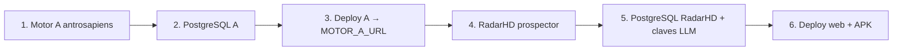

# GUÍA DE RECONSTRUCCIÓN TOTAL — Ecosistema Hamaca Digital

> Permite reconstruir el ecosistema **completo** desde cero. Verificado contra el
> código real (2026-07-25). Dos repos activos: `antrosapiens` (Motor A) y
> `radarHD` (Motor B + C). Los repos `Radar-Hd` y `marito-Aitorhd` son legacy y
> **no se reconstruyen** (solo se conservan como histórico).

## 0. Orden de reconstrucción

Motor A primero: RadarHD lo consume vía `MOTOR_A_URL`. (RadarHD funciona sin él,
pero pierde la fuente objetiva preferida.)

## 1. Motor A — `antrosapiens` (Python/FastAPI)
```bash
git clone https://github.com/Aitor-1977/antrosapiens.git && cd antrosapiens
python3.11 -m venv .venv && source .venv/bin/activate
pip install -r requirements.txt
#  Nota entorno: si feedparser falla por sgmllib3k (Debian/setuptools), instalar
#  el sdist de sgmllib3k manualmente (copiar sgmllib.py a site-packages).
cp .env.example .env          # editar HD_INGEST_TOKEN y HD_DATABASE_URL
python -m scripts.migrate      # crea el esquema (SQLite dev / PostgreSQL prod)
pytest -q                      # verificación: 657 passed
python -m scripts.serve_api    # API + scheduler   (o: uvicorn hd_scraper.api.app:app)
curl localhost:8000/health && curl localhost:8000/laboratorio
```
- **Variables clave** (`config.py`/`.env.example`): `HD_DATABASE_URL`,
  `HD_INGEST_TOKEN` (vacío ⇒ escritura deshabilitada), `HD_SCHEDULE_HOURS`,
  `HD_RAW_*`, `HD_TRACKED_EMPRESAS`, `HD_TRACKED_SLUGS`, `HUNTER_API_KEY`.
- **Deploy (Vercel):** `vercel.json` → `@vercel/python` sobre `api/index.py`;
  conectar PostgreSQL (Neon) → autodetecta `DATABASE_URL`/`POSTGRES_URL`.
  URL de producción actual: `https://hd-prospector.vercel.app`.
- **Migraciones:** idempotentes (`CREATE TABLE IF NOT EXISTS`); `scripts/migrate.py`
  o al primer acceso (`get_db`).
- **Verificación de reproducibilidad:** `GET /certificado/{org}` dos veces ⇒
  mismo `hash` y `firma_motor`.

## 2. Motor B + C — `radarHD` (Next.js 16 / "prospector")
```bash
git clone https://github.com/Aitor-1977/radarHD.git && cd radarHD
npm install                   # Node 20+; Next 16, React 19
cp .env.example .env.local     # configurar (ver claves abajo)
npm run dev                    # http://localhost:3000
npm run test                   # vitest (9 suites)
npm run build && npm run start # producción web
npm run build:apk              # APK Android (Capacitor + gradlew assembleDebug)
```
- **Variables (`.env.example`):**
  - `DATABASE_URL` — **PostgreSQL propia** (distinta de la de Motor A).
  - **LLM:** `GEMINI_API_KEY`, `NVIDIA_API_KEY`, `ANTHROPIC_API_KEY`, `ZENMUX_API_KEY`.
  - **Prospección:** `HUNTER_API_KEY`, `APIFY_API_KEY`.
  - **Comercial:** `TELEGRAM_BOT_TOKEN`, `TELEGRAM_CHAT_ID`.
  - **Crons:** `CRON_SECRET`. **Integración A:** `MOTOR_A_URL`
    (`=https://hd-prospector.vercel.app`), `MOTOR_A_MIN_CONFIANZA`, `MOTOR_A_LIMITE`.
  - **Frontend:** `NEXT_PUBLIC_API_BASE` (para APK apunta al backend remoto),
    `NEXT_PUBLIC_APP_URL`.
- **Esquema:** `src/lib/db.ts:initSchema` crea las 14 tablas (idempotente, `pg`).
- **Deploy:** Vercel (web) + APK firmado (Capacitor/Gradle). CI: `.github/`.
- **Migraciones/seed:** `src/lib/seed.ts`, `drizzle.config` (según scripts del repo).

## 3. Verificación end-to-end del ecosistema
1. Motor A responde `/health` y sirve `/corpus` con `contrato: motor_a.corpus.v1`.
2. En RadarHD, con `MOTOR_A_URL` configurada, `POST /api/radar/run` ingiere el
   corpus (fuente `motor-a.ts`) sin lanzar (contrato v1 válido).
3. El dashboard (`/api/dashboard/metricas`, `admin/dashboard`) muestra datos.
4. El pipeline comercial (`/api/seguimiento`, `/api/cadencia`) opera con su BD.

## 4. Qué NO reconstruir
- `Radar-Hd` (prototipo Google AI Studio, abandonado) y `marito-Aitorhd`
  (monorepo de origen) son **históricos**; el código vivo está en los dos repos
  anteriores. `spec-kit`/`brag` son forks de terceros, ajenos.

## Referencias
- Arquitectura → `ARQUITECTURA_ECOSISTEMA.md` · Contratos → `CONTRATOS_API.md` ·
  Motor A detalle → `DOCUMENTACION_MAESTRA.md` §21.
