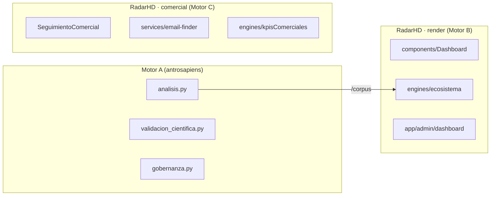

# INVENTARIO DE COMPONENTES — Ecosistema Hamaca Digital

> Verificado (2026-07-25) contra el código de `antrosapiens` y `radarHD`.

## §A. Motor A — `antrosapiens` (Python)

**Módulos** (30 en la raíz de `hd_scraper/` + subpaquetes). Inventario completo
con funciones públicas → `DOCUMENTACION_MAESTRA.md` §5.2. Resumen por capa:
- **Inferencia/análisis:** `analisis.py`, `engine/rule_engine.py`, `dictamen.py`.
- **Ciencia (C11–C18):** `validacion_cientifica.py`, `gobernanza.py`(+`_store`),
  `memoria.py`(+`_store`), `comparador.py`, `predictivo.py`, `observatorio.py`,
  `publicador.py`, `laboratorio.py`.
- **Señales/capas 4–10:** `relevance.py`, `signals.py`, `enrich.py`, `contacto.py`,
  `directorio.py`, `hunter.py`, `drift.py`(+`_compare`), `onlife.py`,
  `pipeline_comercial.py`, `curaduria.py`.
- **Infra:** `pipeline.py`, `scheduler.py`, `jobs.py`, `discovery.py`, `config.py`,
  `connectors/`, `governance/`, `storage/`, `ingesta/`, `validation/`, `db/`, `api/`.

**Conectores (4):** `google_news`, `gdelt`, `rss_fijos`, `job_boards`
(`connectors/__init__.py:REGISTRY`).

## §B. RadarHD — `radarHD` / "prospector" (TypeScript/React)

### B.1 Engines propios (`src/lib/engines/`, 13)
`inference.ts`, `scoring.ts`, `dictamenPericial.ts`, `contradiction.ts`,
`ecosistema.ts`, `onlife.ts`, `priorizacion.ts`, `recomendacion.ts`, `radar.ts`,
`concentrador.ts`, `kpisComerciales.ts`, `ritual.ts`, `tarjeta.ts`.
→ inferencia **con IA**, en paralelo a la determinista de Motor A.

### B.2 Servicios (`src/lib/services/`, 24)
- **IA/LLM:** `llm.ts`, `scoring-llm.ts`, `scoring-reglas.ts`.
- **Peritaje/inteligencia:** `dictamen.service.ts`, `dictamenPericial.service.ts`,
  `ecosistema.service.ts`, `drift.service.ts`, `evidencia.service.ts`,
  `expedientes.service.ts`, `perfil.service.ts`, `recomendacion.service.ts`.
- **Prospección/comercial (Motor C):** `decisores.service.ts`,
  `decisor-hunter.service.ts`, `email-finder.service.ts`, `hunter-search.service.ts`,
  `contactos.service.ts`, `telegram.service.ts`, `fondos.service.ts`,
  `empleos.service.ts`.
- **Fuentes/enriquecimiento:** `apify.service.ts`, `appstore.service.ts`,
  `dominio.service.ts`, `sitio.service.ts`, `wayback.service.ts`.

### B.3 Fuentes (`src/lib/sources/`, 9)
`motor-a.ts` (consume `/corpus` de Motor A), `gdelt.ts`, `google-news.ts`,
`rss.ts`, `adopcion-densificador.ts`, `drift-densificador.ts`,
`empleo-densificador.ts`, `prefiltro.ts`, `types.ts`.

### B.4 Componentes React (`src/components/`, 23)
`Dashboard`, `Sidebar`, `Inteligencia`, `InteligenciaEcosistemica`,
`IntelligencePanel`, `DictamenPanel`, `DriftPanel`, `SignalRelations`,
`OrganizacionesObservadas`, `SenalesNuevas`, `FondosVC`, `InformesPanel`,
`Banners`, `CualificacionLiminalModal`, `TarjetaProspectoHD`, `icons` ·
**Comercial (Motor C):** `Prospectos`, `ProspeccionMasiva`, `SeguimientoComercial`,
`ListaMatutina`, `RecomendacionesEstrategicas`, `KillSwitchModal`, `KillSwitchHistory`.

### B.5 Páginas y plataforma
- App Router: `src/app/admin/dashboard/page.tsx`; 49 rutas API (`src/app/api/`).
- **Móvil:** Capacitor + Android (`android/`, `capacitor.config.ts`,
  `npm run build:apk` → `gradlew assembleDebug`).
- **Tests:** Vitest (9 archivos `__tests__` / `*.test.ts`).
- **Cliente HTTP:** `fetch(${API_BASE}/api/...)`; `API_BASE` de
  `NEXT_PUBLIC_API_BASE` (para APK apunta al backend remoto) — `src/lib/api-base.ts`.
- **Cola:** `src/services/queue.service.ts`. **Proxy:** `src/proxy.ts`.

## §C. Mapa componente → motor lógico

## Referencias
- Endpoints → `INVENTARIO_ENDPOINTS.md` · Tablas → `INVENTARIO_TABLAS.md` ·
  Fronteras → `FRONTERAS_MOTORES.md`.
