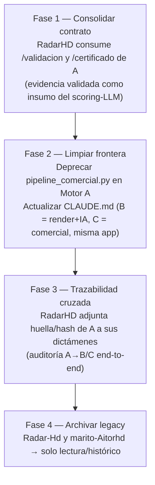

# ROADMAP ARQUITECTÓNICO — Ecosistema Hamaca Digital

> Basado en el **estado real del código** (2026-07-25), no en aspiraciones.
> No altera la arquitectura vigente; propone consolidarla.

## 1. Estado actual (verificado)

| Área | Estado |
|------|--------|
| Motor A (`antrosapiens`): Capas 0–18 | ✅ `[IMPLEMENTADO]` (657 tests, núcleo científico 100%) |
| Motor A: API `/corpus` (contrato v1) | ✅ `[IMPLEMENTADO]` |
| RadarHD (`radarHD`): render (B) + comercial (C) + IA | ✅ `[IMPLEMENTADO]` (49 rutas, 14 tablas, 13 engines) |
| Integración A→RadarHD | ✅ `[PARCIAL]` — solo `GET /corpus`; el resto de la API de A no se consume |
| Consumo de Capas 11–18 de A por RadarHD | ❌ `[NO IMPLEMENTADO]` — RadarHD reimplementa dictamen/scoring con IA |
| Separación física B / C | ❌ `[NO IMPLEMENTADO]` — B y C son la misma app (`prospector`) |
| Repos legacy `Radar-Hd`, `marito-Aitorhd` | 🗄️ archivar |

## 2. Tensiones arquitectónicas detectadas (a resolver sin romper contratos)

1. **Doble inferencia (A determinista vs RadarHD con IA).** Ambos producen
   dictamen/scoring/drift/onlife/ecosistema. Es intencional (A objetivo, B/C
   interpretativo) pero hoy **desacoplado**: RadarHD no aprovecha la Validación
   Científica (C11) ni la Gobernanza (C12) de A.
2. **`pipeline_comercial.py` vestigial en Motor A.** El pipeline comercial real
   está en RadarHD (Motor C). Motor A no debería modelar comercial.
3. **Frontera declarada ≠ real** (`CLAUDE.md`: "B solo renderiza"). Actualizar la
   norma para reflejar que RadarHD = B + C con inteligencia propia (IA).

## 3. Roadmap propuesto (fases, sin alterar la arquitectura)

### Fase 1 — Consolidar el contrato (aprovechar la ciencia de A) `[PENDIENTE]`
- RadarHD consume, además de `/corpus`, los endpoints `GET /validacion/{org}` y
  `GET /certificado/{org}` de Motor A para **usar el veredicto determinista** como
  señal fuerte en su scoring-LLM (reducir falsos positivos con evidencia validada).
- Extensión **aditiva** del contrato (no rompe `motor_a.corpus.v1`).

### Fase 2 — Limpiar la frontera `[PENDIENTE]`
- **Deprecar** `pipeline_comercial.py` + tablas `pipeline_comercial`/
  `pipeline_transiciones` en Motor A (marcar `[DEPRECADO]`), dado que el comercial
  real vive en RadarHD.
- **Actualizar `CLAUDE.md`** de Motor A: sustituir "Motor B únicamente renderiza"
  por la descripción real (RadarHD = render + inteligencia con IA + comercial).

### Fase 3 — Trazabilidad cruzada `[PENDIENTE]`
- RadarHD guarda el `hash`/`certificado_id` del expediente de Motor A que originó
  cada prospecto → auditoría reproducible **de extremo a extremo** entre motores.

### Fase 4 — Archivar legacy `[PENDIENTE]`
- `Radar-Hd` y `marito-Aitorhd`: marcar como archivados; congelar.

## 4. Principios que el roadmap NO debe violar
- Motor A permanece **determinista y sin IA**.
- El contrato `motor_a.corpus.v1` solo evoluciona de forma **aditiva** (o `v2`).
- Ninguna BD se comparte entre motores; la integración es por **HTTP + contrato**.

## Referencias
- Fronteras → `FRONTERAS_MOTORES.md` · Contratos → `CONTRATOS_API.md` ·
  Inconsistencias → `DOCUMENTACION_MAESTRA.md` §24.
