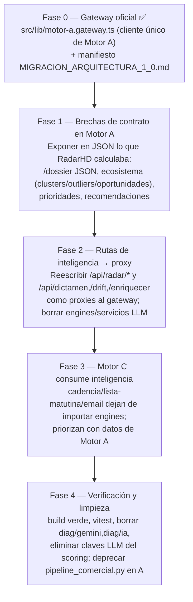

# ROADMAP ARQUITECTÓNICO — Migración a Arquitectura 1.0

> **Decisión oficial ADR-0001:** *Motor A piensa. Motor B muestra. Motor C vende.*
> Este roadmap es el **plan de cutover** desde el estado actual (RadarHD infiere
> con IA) al estado 1.0 (Motor A = único motor de inferencia). Basado en el
> código real (2026-07-25). Manifiesto de ejecución en RadarHD:
> `MIGRACION_ARQUITECTURA_1_0.md`.

## 1. Estado actual (verificado)

| Área | Estado |
|------|--------|
| Motor A (`antrosapiens`): Capas 0–18 | ✅ `[IMPLEMENTADO]` (657 tests, núcleo científico 100%) |
| Motor A: API `/corpus` (contrato v1) | ✅ `[IMPLEMENTADO]` |
| RadarHD (`radarHD`): render (B) + comercial (C) + IA | ✅ `[IMPLEMENTADO]` (49 rutas, 14 tablas, 13 engines) |
| Integración A→RadarHD | ✅ `[PARCIAL]` — solo `GET /corpus`; el resto de la API de A no se consume |
| Consumo de Capas 11–18 de A por RadarHD | ❌ `[NO IMPLEMENTADO]` — RadarHD reimplementa dictamen/scoring con IA |
| Separación física B / C | ❌ `[NO IMPLEMENTADO]` — B y C son la misma app (`prospector`) |
| Repos legacy `Radar-Hd`, `marito-Aitorhd` | 🗄️ archivar |

## 2. Tensiones arquitectónicas detectadas (a resolver sin romper contratos)

1. **Doble inferencia (A determinista vs RadarHD con IA).** Ambos producen
   dictamen/scoring/drift/onlife/ecosistema. Es intencional (A objetivo, B/C
   interpretativo) pero hoy **desacoplado**: RadarHD no aprovecha la Validación
   Científica (C11) ni la Gobernanza (C12) de A.
2. **`pipeline_comercial.py` vestigial en Motor A.** El pipeline comercial real
   está en RadarHD (Motor C). Motor A no debería modelar comercial.
3. **Frontera declarada ≠ real** (`CLAUDE.md`: "B solo renderiza"). Actualizar la
   norma para reflejar que RadarHD = B + C con inteligencia propia (IA).

## 3. Plan de cutover a Arquitectura 1.0 (fases)

### Fase 0 — Cimiento (EJECUTADA) `[IMPLEMENTADO]`
- Gateway oficial `src/lib/motor-a.gateway.ts` en RadarHD: cliente único de los
  endpoints científicos de Motor A. Aditivo, no rompe nada.
- Manifiesto de migración con el mapa de acoplamiento (`engines/scoring` importado
  por 11 archivos, etc.) y el mapeo ruta-RadarHD → endpoint-Motor-A.

### Fase 1 — Brechas de contrato en Motor A `[PENDIENTE — bloqueante]`
RadarHD calcula localmente cosas que Motor A **no expone aún en JSON consumible**.
Antes del cutover, Motor A debe exponer:
- `/dossier/{org}` y `/dolormap/{org}` en **JSON** (hoy dossier es HTML).
- Agregados ecosistémicos: **clusters, outliers, centinelas, patrones, tendencias**
  (RadarHD `/api/radar/ecosistema/*`) — mapear a `/latam`, `/vertical`, `/comparar`
  o añadir endpoints nuevos.
- **oportunidades, prioridades, recomendaciones** (ranking) — desde `/alertas`,
  `/expedientes`, `/latam` o endpoint nuevo.
Extensiones **aditivas** al contrato `motor_a.corpus.v1` o endpoints nuevos.

### Fase 2 — Rutas de inteligencia → proxy y borrado de engines `[PENDIENTE]`
- Reescribir cada ruta de inteligencia de RadarHD como **proxy** al gateway.
- **Eliminar** `engines/{inference,scoring,dictamenPericial,contradiction,
  ecosistema,onlife,priorizacion,recomendacion,radar}` y `services/{llm,
  scoring-llm,scoring-reglas,dictamen*,drift,ecosistema,evidencia,expedientes,
  perfil,recomendacion}`.
- **Cutover coordinado**: `engines/scoring` lo importan 11 archivos (incl. rutas
  comerciales) → no se borra hasta reescribir todos sus importadores.

### Fase 3 — Motor C consume inteligencia `[PENDIENTE]`
- `cadencia`, `lista-matutina`, `email-decisor` dejan de importar engines de
  inferencia; priorizan con la inteligencia (validada/certificada) de Motor A.

### Fase 4 — Verificación y limpieza `[PENDIENTE]`
- `npm run build` verde + `vitest`. Borrar `/api/diag/{gemini,ia}` y las claves
  LLM de clasificación. En **Motor A**: deprecar `pipeline_comercial.py` +
  tablas homónimas (el comercial real vive en RadarHD).
- Archivar `Radar-Hd` y `marito-Aitorhd`.

## 4. Principios que el roadmap NO debe violar
- Motor A permanece **determinista y sin IA**.
- El contrato `motor_a.corpus.v1` solo evoluciona de forma **aditiva** (o `v2`).
- Ninguna BD se comparte entre motores; la integración es por **HTTP + contrato**.

## Referencias
- Fronteras → `FRONTERAS_MOTORES.md` · Contratos → `CONTRATOS_API.md` ·
  Inconsistencias → `DOCUMENTACION_MAESTRA.md` §24.
