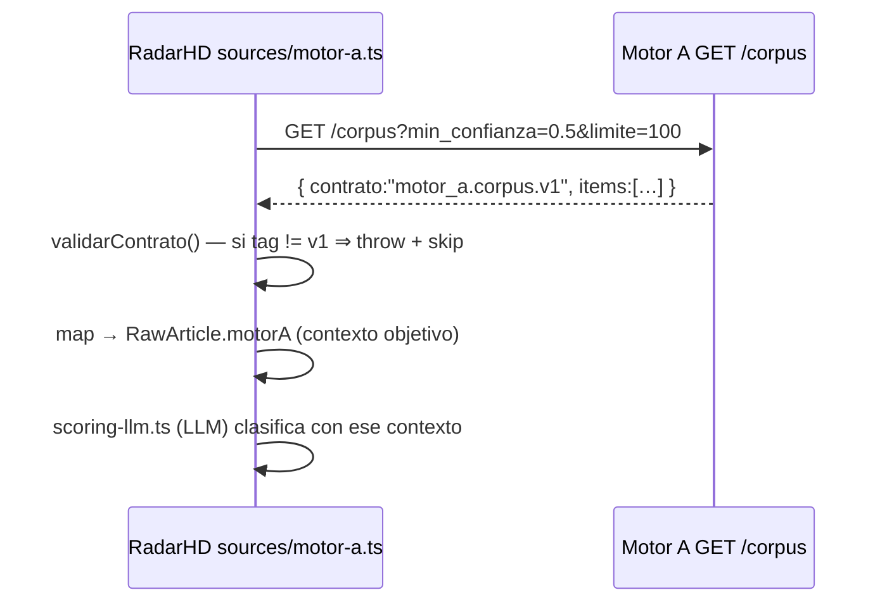

# CONTRATOS DE API — Ecosistema Hamaca Digital

> Verificado en el código de ambos lados (2026-07-25):
> productor `antrosapiens/hd_scraper/api/app.py:292` (`GET /corpus`) y consumidor
> `radarHD/src/lib/sources/motor-a.ts`.

## 1. Contrato de integración A → (B+C): `motor_a.corpus.v1`

**Único punto de acoplamiento verificado entre motores.** Motor A publica hechos
objetivos; RadarHD los consume como **contexto** para su propia clasificación con IA.

### 1.1 Productor — `GET /corpus` (Motor A)
Parámetros (query): `empresa`, `categoria` (VC|Startup|Incubadora|Corporativo),
`tipo_evento`, `min_confianza` (0–1), `desde`, `hasta` (ISO 8601),
`limite` (1–1000, def. 100), `offset`. Solo sirve `estado='ok'`.

Respuesta:
```json
{
  "contrato": "motor_a.corpus.v1",
  "total": 128, "limite": 100, "offset": 0,
  "items": [
    {
      "empresa": "Nubank", "fuente": "Bloomberg Línea",
      "fecha": "2026-07-01", "texto": "…churn…", "url": "https://…",
      "keywords": ["friccion_retencion"], "confianza": 0.8,
      "calidad_captura": "Alta", "categoria": "Startup",
      "tipo_evento": "queja", "hash": "…"
    }
  ]
}
```
**Lo que el contrato NO incluye (por diseño):** Deuda Cultural™, score ICP,
hipótesis. Cita literal del código: *"NO incluye Deuda Cultural™, Interés ni
hipótesis: eso lo aplica el Motor B (RadarHD)"* (`app.py:292`).

### 1.2 Consumidor — `sources/motor-a.ts` (RadarHD)
- URL: `MOTOR_A_URL` (o `HD_PROSPECTOR_URL`); si falta, **la fuente se salta**
  silenciosamente (la corrida sigue con GDELT/RSS/Apify).
- **Validación de contrato:** si `contrato !== "motor_a.corpus.v1"` → **lanza** y
  salta la fuente (no ingiere formas desconocidas). `CONTRATO_CORPUS` constante.
- Filtros por defecto: `MOTOR_A_MIN_CONFIANZA=0.5`, `MOTOR_A_LIMITE=100`.
- Mapea cada item a `RawArticle` arrastrando las señales objetivas en `motorA`;
  **RadarHD no re-adivina** lo ya extraído, lo usa como contexto del scoring-LLM.
- **Versionado aditivo:** `calidad_captura` se documenta como *"extensión aditiva
  del contrato v1"* → cambios compatibles no rompen el consumidor.

### 1.3 Diagrama del contrato


## 1bis. Contrato del dossier JSON: `motor_a.dossier.v1` (Cutover 1.0)

`GET /dossier/{org}?formato=json` — **fuente única** de inteligencia por
organización para RadarHD (el `formato=html` por defecto se mantiene). Devuelve
en un solo objeto (todo determinista, sin IA):

`resumen_ejecutivo` · `narrativa_dominante` · `hipotesis_central` ·
`clasificacion_deuda_cultural` · `nivel_confianza` · `calidad_evidencia` ·
`profundidad_friccion` · `patrones` · `contradicciones` · `vacios` · `drift` ·
`onlife` · `dolormap` · `validacion_cientifica` · `gobernanza` (huella +
integridad + consistencia + certificado) · `auditoria` · `cronologia` ·
`cadena_evidencia` · `fuentes` · `clusters_relacionados` · `outliers_relacionados`
· `contexto_ecosistemico` · `ranking` · `prioridad_hd` · `estado_pipeline`.

Se compone reutilizando `dolormap`, `validar_expediente` (C11),
`auditar_expediente`/`emitir_certificado` (C12), `curar` (C10),
`ranking_hd`/`contexto_ecosistemico`/`detectar_outliers` (C16). No recalcula nada.

## 1ter. Endpoints ecosistémicos JSON (Cutover 1.0)

Cierran las brechas que RadarHD calculaba localmente. Todos deterministas:

| Endpoint | Devuelve |
|----------|----------|
| `GET /ecosistema?limite=` | panorama completo: indicadores, clusters, outliers, centinelas, riesgos_culturales, madurez, calidad_corpus, ranking, oportunidades, prioridades |
| `GET /ecosistema/clusters` | clusters por (deuda cultural, vertical) |
| `GET /ecosistema/outliers` | organizaciones atípicas (ICP >1σ, deuda única, profundidad sin volumen) |
| `GET /ecosistema/centinelas` | dolor profundo emergente (corpus escaso) |
| `GET /ecosistema/riesgos` | riesgo cultural agregado (reutiliza Predictivo) |
| `GET /ecosistema/madurez` | madurez agregada del ecosistema |
| `GET /calidad-corpus` | fechado, fuentes, confianza, cobertura suficiente |
| `GET /ranking?limite=` | Ranking HD: prioridad, motivo, evidencias, nivel de confianza |
| `GET /oportunidades?limite=` | oportunidades analíticas: por qué / para quién / evidencia / confianza (SIN recomendación comercial) |
| `GET /prioridades?limite=` | prioridades (validadas primero) |

**Compatibilidad:** todas son adiciones; no rompen `motor_a.corpus.v1` ni rutas
existentes. OpenAPI (`/openapi.json`, `/docs`) se regenera automáticamente.

## 1quater. Contrato del Expediente Vivo (paridad de forma, Cutover 1.0)

Motor A emite EXACTAMENTE las formas que consumen los componentes tipados del
"Radar de Organizaciones Observadas" de RadarHD
(`OrganizacionesObservadas.tsx`). Todo determinista; sin IA. Implementación:
`hd_scraper/expediente_vivo.py`. Gateway: `motorA.organizaciones/organizacion/
organizacionDrift` en `src/lib/motor-a.gateway.ts`.

| Endpoint (Motor A) | Forma RadarHD | Consumidor de RadarHD |
|--------------------|---------------|-----------------------|
| `GET /organizaciones` | `{ generado_en, resumen, total, organizaciones: OrganizacionObservada[] }` | `GET /api/radar/organizaciones` |
| `GET /organizaciones/{id}` | `Dossier` (OrganizacionObservada + `cadena_evidencia`, `fuentes`, `contexto_ecosistemico`, `recomendacion_estrategica`, `dictamen_pericial`, `tiene_analisis_onlife`, `dolormap`) | `GET /api/radar/organizaciones/{id}` |
| `GET /organizaciones/{id}/drift` | `{ organizacion_id, drift: { detectado, resumen, ultima_fecha, num_observaciones } }` | `GET /api/radar/drift/{id}` |

**Espacio de identificadores.** `organizacion_id` es un entero determinista
(índice en orden alfabético del nombre, vía `observatorio._id_map`). El listado y
el detalle comparten ese mismo espacio: el detalle y el drift se resuelven por id
numérico. Las `evidencia_ids` de la inferencia remiten a los `id` de
`cadena_evidencia` (trazabilidad afirmación → fuente).

**Frontera A/C respetada.** Los campos comerciales `recomendacion_estrategica` y
`dictamen_pericial` viajan **`null`**: son decisión y ejecución comercial de
**Motor C** (ADR-0001), no de Motor A. `dolormap` viaja `null` (sin fuente de
datos todavía). Motor A **no inventa** ninguno de esos campos: los emite vacíos.

**Estado de migración (Fase 3 · EJECUTADA).** Contrato + endpoints + gateway ✅
(`pytest` verde, 99% del módulo). Las **rutas del Expediente Vivo YA consumen
exclusivamente Motor A**:

- `GET /api/radar/organizaciones` (listado) y `GET /api/radar/organizaciones/[id]`
  (detalle) obtienen la inteligencia científica (Curaduría, Inferencia
  Antropológica, cadena de evidencia, fuentes, Contexto Ecosistémico) del
  gateway. RadarHD **ya no** reconstruye el Expediente Vivo con `curar()`/
  `interpretar()` locales: `expedientes.service` es ahora un **adaptador** que
  mapea `OrganizacionObservada`/`Dossier` de Motor A a la forma `ExpedienteVivo`.
- `GET /api/radar/drift/[id]` consume `GET /organizaciones/{id}/drift` de Motor A.
- **Capa comercial (Motor C)**: `recomendacion_estrategica` y `dictamen_pericial`
  las compone RadarHD server-side (nunca en React) a partir de la MISMA
  inteligencia de Motor A (vía el gateway, dentro de los servicios) más el
  vínculo local con `prospecto` (decisor). Motor A las emite `null` por frontera
  (ADR-0001: no decide ni ejecuta acción comercial). Así el dossier conserva esas
  secciones sin que Motor A cruce la frontera comercial. Sin cambios visuales.

Enriquecimiento del contrato: los ítems de `GET /organizaciones` incluyen ahora
`vertical`, `cadena_evidencia` y `fuentes` (aditivo) para que Motor C reconstruya
la trazabilidad sin volver al detalle. Detalle → `ROADMAP_ARQUITECTONICO.md` §Fase 3.

## 2. Superficie API de Motor A (82 endpoints, solo lectura)
Inventario completo → `INVENTARIO_ENDPOINTS.md` §A. Contrato principal expuesto:
`/corpus`. El resto (`/expedientes`, `/validacion`, `/certificado`, `/dossier`,
`/laboratorio`, …) **está disponible pero RadarHD hoy NO lo consume** (solo usa
`/corpus`). Oportunidad de integración → `ROADMAP_ARQUITECTONICO.md`.

## 3. Superficie API de RadarHD (49 rutas `/api/*`, internas de la app)
Son rutas **internas** del Next.js (consumidas por su propia UI y crons), **no**
un contrato público para Motor A (Motor A no llama a RadarHD). Inventario completo
→ `INVENTARIO_ENDPOINTS.md` §B. Grupos:
- **radar/**: motor de inteligencia propio (ecosistema, dictamen, drift, onlife,
  organizaciones, senales, oportunidades, prioridades, recomendaciones, run, cron).
- **comercial**: `cadencia`, `seguimiento`, `email-decisor`, `kill-switch`,
  `lista-matutina`, `decisores`, `prospeccion`.
- **soporte**: `dashboard/metricas`, `informes`, `enriquecer`, `dictamen`,
  `diag/*` (gemini, ia, drift, sitio), `sow`, `tarjeta`.

### 3.1 Autenticación / seguridad de RadarHD (verificado en `.env.example`)
`CRON_SECRET` (protege crons), claves LLM (`GEMINI_API_KEY`, `NVIDIA_API_KEY`,
`ANTHROPIC_API_KEY`, `ZENMUX_API_KEY`), `HUNTER_API_KEY`, `APIFY_API_KEY`,
`TELEGRAM_BOT_TOKEN`/`TELEGRAM_CHAT_ID`, `DATABASE_URL` (PostgreSQL propia).

## 4. Reglas del contrato (gobernanza de compatibilidad)
1. El tag `motor_a.corpus.v1` es el **candado**: cambios incompatibles exigen
   `v2` (el consumidor rechaza tags desconocidos).
2. Extensiones **aditivas** (nuevos campos opcionales) son compatibles
   (`calidad_captura` es el precedente).
3. Motor A **nunca** debe meter interpretación (Deuda/ICP/hipótesis) en `/corpus`.

## Referencias
- Fronteras → `FRONTERAS_MOTORES.md` · Endpoints → `INVENTARIO_ENDPOINTS.md` ·
  Tablas → `INVENTARIO_TABLAS.md` · Arquitectura → `ARQUITECTURA_ECOSISTEMA.md`.
