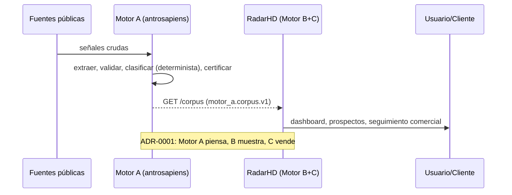

# Diagrama — Comunicación entre motores

> Generado por `scripts/docs/gen_diagramas.py`. Compatible con Mermaid.
> Regenerar: `python -m scripts.docs.gen_diagramas`.

```mermaid
sequenceDiagram
    participant F as Fuentes públicas
    participant A as Motor A (antrosapiens)
    participant R as RadarHD (Motor B+C)
    participant U as Usuario/Cliente
    F->>A: señales crudas
    A->>A: extraer, validar, clasificar (determinista), certificar
    A-->>R: GET /corpus (motor_a.corpus.v1)
    R->>U: dashboard, prospectos, seguimiento comercial
    Note over A,R: ADR-0001: Motor A piensa, B muestra, C vende
```
