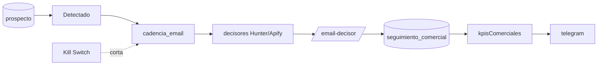

# Diagrama — Pipeline comercial (Motor C, en RadarHD)

> Generado por `scripts/docs/gen_diagramas.py`. Compatible con Mermaid.
> Regenerar: `python -m scripts.docs.gen_diagramas`.

```mermaid
flowchart LR
    P[(prospecto)] --> DET[Detectado] --> CAD[cadencia_email]
    CAD --> DEC[decisores Hunter/Apify] --> EMAIL[/email-decisor/]
    EMAIL --> SEG[(seguimiento_comercial)]
    SEG --> KPI[kpisComerciales] --> TEL[telegram]
    KS[Kill Switch] -.->|corta| CAD
```
