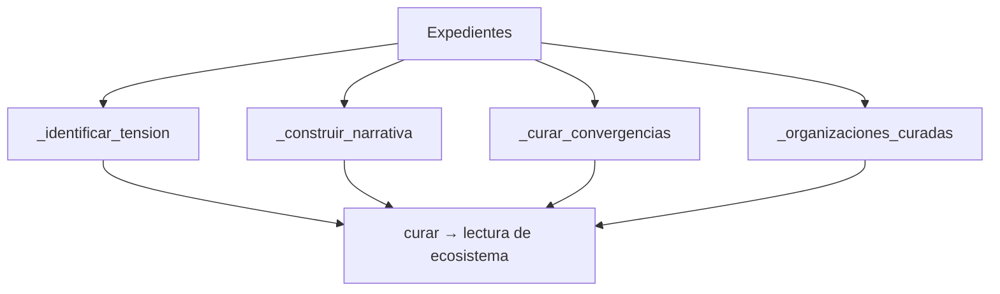

# Diagrama — Curaduría Antropológica (Capa 10)

> Generado por `scripts/docs/gen_diagramas.py`. Compatible con Mermaid.
> Regenerar: `python -m scripts.docs.gen_diagramas`.

```mermaid
flowchart TB
    EXPS[Expedientes] --> TEN[_identificar_tension]
    EXPS --> NAR[_construir_narrativa]
    EXPS --> CONV[_curar_convergencias]
    EXPS --> ORGS[_organizaciones_curadas]
    TEN & NAR & CONV & ORGS --> CUR[curar → lectura de ecosistema]
```
