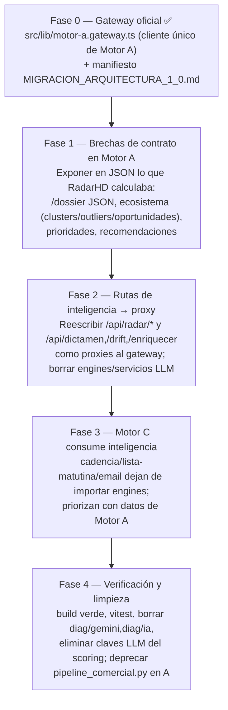

# ROADMAP ARQUITECTÓNICO — Migración a Arquitectura 1.0

> **Decisión oficial ADR-0001:** *Motor A piensa. Motor B muestra. Motor C vende.*
> Este roadmap es el **plan de cutover** desde el estado actual (RadarHD infiere
> con IA) al estado 1.0 (Motor A = único motor de inferencia). Basado en el
> código real (2026-07-25). Manifiesto de ejecución en RadarHD:
> `MIGRACION_ARQUITECTURA_1_0.md`.

## 1. Estado actual (verificado)

| Área | Estado |
|------|--------|
| Motor A (`antrosapiens`): Capas 0–18 | ✅ `[IMPLEMENTADO]` (657 tests, núcleo científico 100%) |
| Motor A: API `/corpus` (contrato v1) | ✅ `[IMPLEMENTADO]` |
| RadarHD (`radarHD`): render (B) + comercial (C) + IA | ✅ `[IMPLEMENTADO]` (49 rutas, 14 tablas, 13 engines) |
| Integración A→RadarHD | ✅ `[PARCIAL]` — solo `GET /corpus`; el resto de la API de A no se consume |
| Consumo de Capas 11–18 de A por RadarHD | ❌ `[NO IMPLEMENTADO]` — RadarHD reimplementa dictamen/scoring con IA |
| Separación física B / C | ❌ `[NO IMPLEMENTADO]` — B y C son la misma app (`prospector`) |
| Repos legacy `Radar-Hd`, `marito-Aitorhd` | 🗄️ archivar |

## 2. Tensiones arquitectónicas detectadas (a resolver sin romper contratos)

1. **Doble inferencia (A determinista vs RadarHD con IA).** Ambos producen
   dictamen/scoring/drift/onlife/ecosistema. Es intencional (A objetivo, B/C
   interpretativo) pero hoy **desacoplado**: RadarHD no aprovecha la Validación
   Científica (C11) ni la Gobernanza (C12) de A.
2. **`pipeline_comercial.py` vestigial en Motor A.** El pipeline comercial real
   está en RadarHD (Motor C). Motor A no debería modelar comercial.
3. **Frontera declarada ≠ real** (`CLAUDE.md`: "B solo renderiza"). Actualizar la
   norma para reflejar que RadarHD = B + C con inteligencia propia (IA).

## 3. Plan de cutover a Arquitectura 1.0 (fases)

### Fase 0 — Cimiento (EJECUTADA) `[IMPLEMENTADO]`
- Gateway oficial `src/lib/motor-a.gateway.ts` en RadarHD: cliente único de los
  endpoints científicos de Motor A. Aditivo, no rompe nada.
- Manifiesto de migración con el mapa de acoplamiento (`engines/scoring` importado
  por 11 archivos, etc.) y el mapeo ruta-RadarHD → endpoint-Motor-A.

### Fase 1 — Brechas de contrato en Motor A `[EJECUTADA — 2026-07-25]`
Motor A ya expone en JSON toda la inteligencia que RadarHD calculaba localmente:
- ✅ `GET /dossier/{org}?formato=json` — dossier completo (`motor_a.dossier.v1`);
  `/dolormap/{org}` ya devolvía JSON.
- ✅ Agregados ecosistémicos: `GET /ecosistema` (+ `/clusters`, `/outliers`,
  `/centinelas`, `/riesgos`, `/madurez`) y `GET /calidad-corpus`.
- ✅ Ranking/oportunidades/prioridades: `GET /ranking`, `/oportunidades`, `/prioridades`.
Todo determinista, aditivo (no rompe `motor_a.corpus.v1`), OpenAPI regenerado.
Implementación: `hd_scraper/observatorio.py` (+ `_dossier_json` en `api/app.py`).
Detalle: `CONTRATOS_API.md §1bis/§1ter`.

### Fase 2 — Rutas de inteligencia → proxy y borrado de engines `[EN CURSO]`
- Reescribir cada ruta de inteligencia de RadarHD como **proxy** al gateway.
- **Ecosistémicas ✅**: `ecosistema/dashboard` (→ `motorA.panel()`), `ecosistema`,
  `clusters`, `outliers`, `centinelas`, `patrones`, `riesgos`, `tendencias` y
  `onlife/[org]` (→ `motorA.onlifeAnalisis`) ya consumen Motor A; `tsc=0`.
- **Expediente Vivo — paridad de forma ✅ / flip de ruta diferido**: Motor A ya
  emite las formas exactas `OrganizacionObservada` (listado), `Dossier` (detalle)
  y `Drift` — `GET /organizaciones`, `/organizaciones/{id}`, `/organizaciones/{id}/drift`
  (`hd_scraper/expediente_vivo.py`, `pytest` verde, 99% cobertura del módulo) — con
  métodos de gateway `organizaciones/organizacion/organizacionDrift`. El **cambio
  de las rutas proxy** (`organizaciones`, `organizaciones/[id]`, `drift/[org]`)
  **se difiere a la Fase 3**: el detalle todavía renderiza
  `recomendacion_estrategica` y `dictamen_pericial` desde servicios **comerciales**
  locales (Motor C); redirigir el detalle a Motor A **antes** de migrar Motor C
  haría desaparecer esas secciones del dossier (cambio visual, prohibido). Motor A
  las emite `null` por diseño (ADR-0001). Detalle → `CONTRATOS_API.md §1quater`.
- **Eliminar** `engines/{inference,scoring,dictamenPericial,contradiction,
  ecosistema,onlife,priorizacion,recomendacion,radar}` y `services/{llm,
  scoring-llm,scoring-reglas,dictamen*,drift,ecosistema,evidencia,expedientes,
  perfil,recomendacion}`.
- **Cutover coordinado**: `engines/scoring` lo importan 11 archivos y
  `concentrador`/`expedientes.service` siguen importados por las rutas del
  Expediente Vivo y por componentes con cálculo en render (`IntelligencePanel`,
  `Prospectos`) → **no se borran hasta reescribir todos sus importadores**
  (regla "nunca borrar primero"; solo se elimina lo que quede sin importadores).

### Fase 3 — Motor C consume inteligencia `[EJECUTADA (Expediente Vivo) — 2026-07-29]`
Migrado el **detalle del Expediente Vivo** sin alterar la experiencia visual:
- `expedientes.service` (constructor único del Expediente Vivo) YA **no infiere
  localmente**: es un adaptador que consume Motor A vía gateway
  (`motorA.organizaciones()`/`organizacion(id)`) y mapea a `ExpedienteVivo`.
  `curar()`/`interpretar()`/`calcularViabilidadHd()`/`calcularAlerta()` salen del
  camino de producción (quedan solo en el engine + su test).
- Rutas `organizaciones`, `organizaciones/[id]` y `drift/[id]` consumen
  **exclusivamente Motor A**. El detalle usa el `contexto_ecosistemico` de Motor A
  directamente (ya no `obtenerEcosistema`+`contextualizarOrganizacion`).
- **Motor C** (server-side, nunca React): `recomendacion_estrategica` y
  `dictamen_pericial` se derivan de la inteligencia de Motor A (vía gateway) +
  el `prospecto` local. Motor A las emite `null` por frontera comercial.
- **Código muerto eliminado**: `derivarDriftNarrativo`/`DriftNarrativo` (drift
  ahora es de Motor A). No se borran `concentrador`/`expedientes.service` porque
  siguen con importadores vivos (`concentrar`, `calcularImplicacionSistemica`,
  `canonicalizar`, el adaptador, y las funciones de inferencia cubiertas por
  `concentrador.test.ts`) — regla "eliminar únicamente código muerto".
- Verificación: `tsc=0`, `vitest` 205/205, `next build` verde, `pytest` 726/726.

### Fase 4 — Migración comercial y eliminación física `[ANALIZADA — 2026-07-29]`

**Resultado: la migración comercial ya estaba completa tras la Fase 3; la
eliminación física de `concentrador.ts`/`expedientes.service.ts` NO procede
(quedan importadores vivos y load-bearing).** Se aplicó el protocolo de 7 pasos
(paso 1: mapa de importadores); se documenta el bloqueo en vez de romper paneles
(regla "si aún tienen importadores, NO los borres: reporta cuáles y por qué").

**Consumidores comerciales — estado real (verificado en el código):**
- `dictamen`, `recomendaciones`, `prioridades`, `oportunidades`, `dictamen/[org]`
  → consumen `recomendacion.service`/`dictamenPericial.service`, que **ya son
  Motor-A-fed** vía el adaptador (Fase 3). Sin inferencia local. ✅
- `cadencia` → `engines/scoring` (contadores de cadencia comercial);
  `lista-matutina` → `engines/priorizacion` (selección de lista matutina);
  `email-decisor` → `email-finder`/`dominio` + `SMTP_MINIMO`. Son **operación
  comercial (Motor C)**, NO inferencia antropológica; **no importan**
  `concentrador` ni `expedientes.service`. No requieren migración. ✅

**Por qué NO se eliminan los dos archivos (importadores vivos):**
- `concentrador.ts` es **load-bearing del subsistema de ingesta local** de
  RadarHD, no de la inferencia del Expediente Vivo (esa ya es de Motor A):
  - `canonicalizar` → `evidencia.service` + densificadores (drift/empleo/adopción)
    → escriben `senal_radar`, que **leen paneles vivos**: `radar/senales`,
    `dashboard/metricas`, `lista-matutina`, `radar/cron`, `tarjeta/[id]`.
  - `concentrar` → `admin/ejecutar-todo` + POST de `organizaciones` → pobla
    `observacion` (fingerprint de caché de `ecosistema.service`).
  - `calcularImplicacionSistemica` → ruta `organizaciones` + `dictamenPericial.
    service`; preserva el **texto exacto** del bloque "Implicación Sistémica"
    (cambiar la fuente alteraría el copy → prohibido por "verse idéntico").
  - `curar`/`interpretar` (curaduría) → cubiertos por `concentrador.test.ts`.
  Borrarlo **rompería paneles** → viola "ningún panel puede quedar vacío o roto".
- `expedientes.service.ts` es el **único adaptador compartido** Motor A→Motor C
  (sin inferencia local desde la Fase 3). Dejarlo sin importadores exigiría
  **duplicar** el adaptador en cada consumidor (viola "sin duplicación") o
  acoplar el gateway HTTP a Postgres. Se conserva **por diseño** como adaptador
  único.

**Condición de cierre:** no cumplida por dependencias reales; documentada. La
eliminación física real depende de una iniciativa aparte: **desmontar el
subsistema de ingesta local** (que Motor A sustituya también la captura que hoy
llena `senal_radar`), fuera del alcance "migrar consumidores comerciales".
Verificación de no-regresión: `tsc=0`, `vitest` 205/205.

### Fase 5 — Verificación y limpieza `[PENDIENTE]`
- `npm run build` verde + `vitest`. Borrar `/api/diag/{gemini,ia}` y las claves
  LLM de clasificación. En **Motor A**: deprecar `pipeline_comercial.py` +
  tablas homónimas (el comercial real vive en RadarHD).
- Sustituir la ingesta local (`engines/radar` + densificadores + `concentrar`)
  por consumo de Motor A; recién entonces `concentrador.ts` quedará sin
  importadores y podrá eliminarse.
- Archivar `Radar-Hd` y `marito-Aitorhd`.

## 4. Principios que el roadmap NO debe violar
- Motor A permanece **determinista y sin IA**.
- El contrato `motor_a.corpus.v1` solo evoluciona de forma **aditiva** (o `v2`).
- Ninguna BD se comparte entre motores; la integración es por **HTTP + contrato**.

## Referencias
- Fronteras → `FRONTERAS_MOTORES.md` · Contratos → `CONTRATOS_API.md` ·
  Inconsistencias → `DOCUMENTACION_MAESTRA.md` §24.
